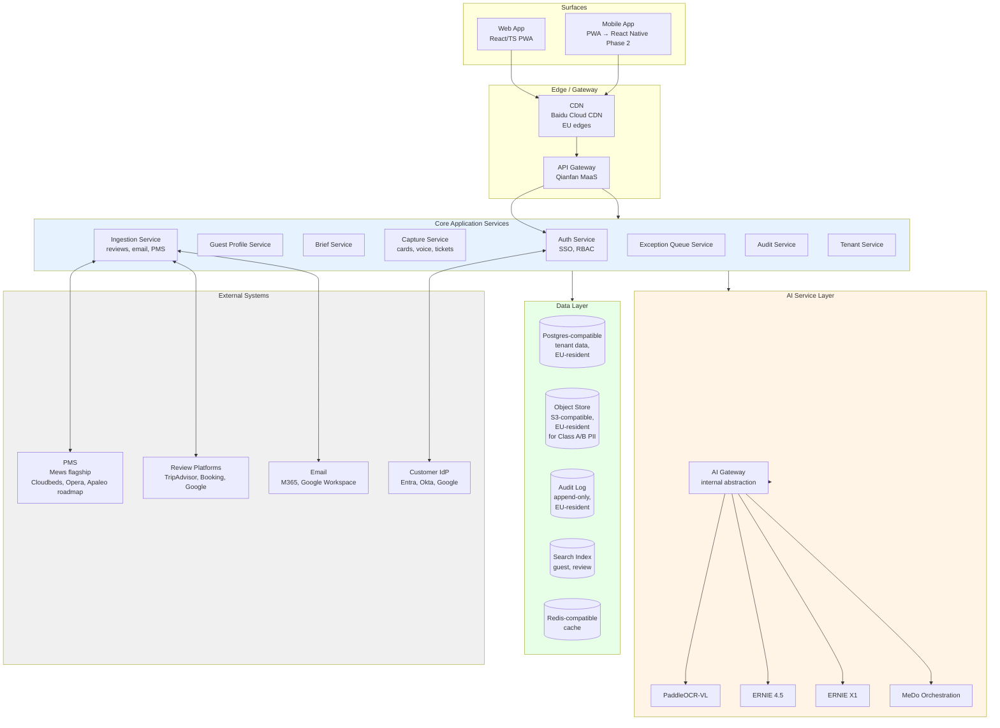
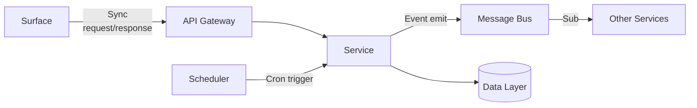
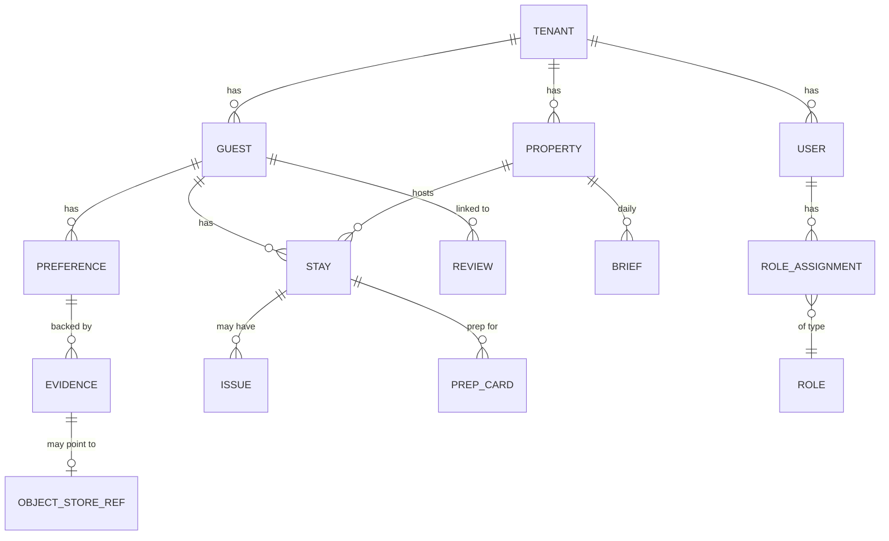
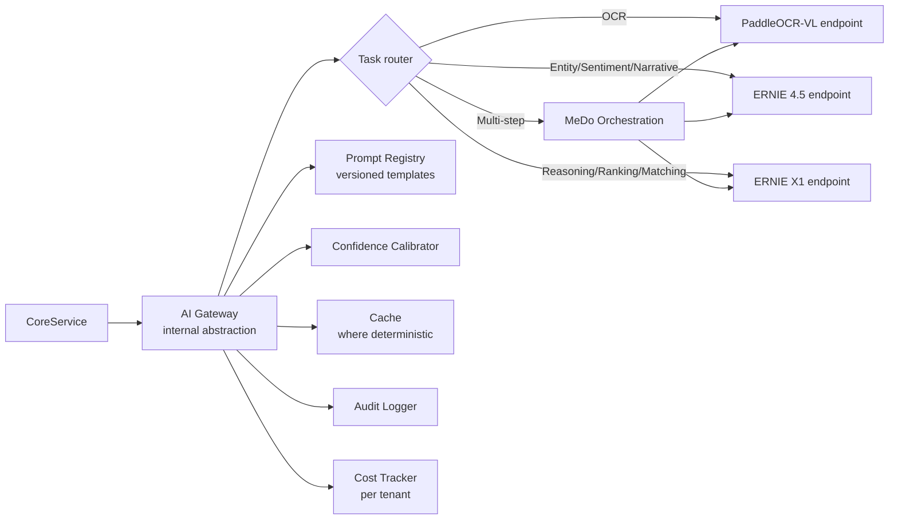
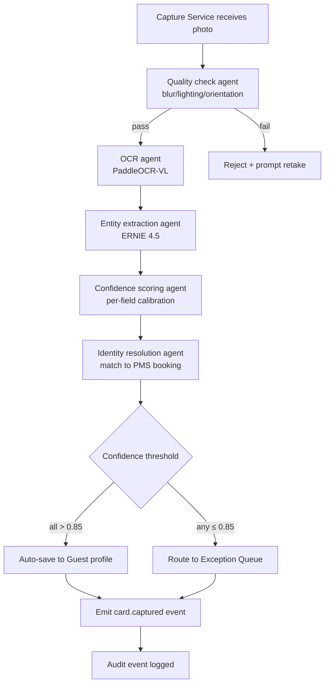
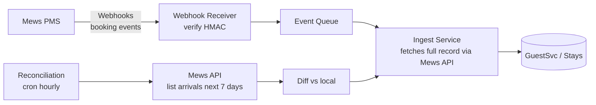
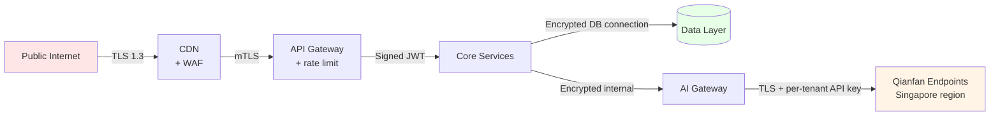
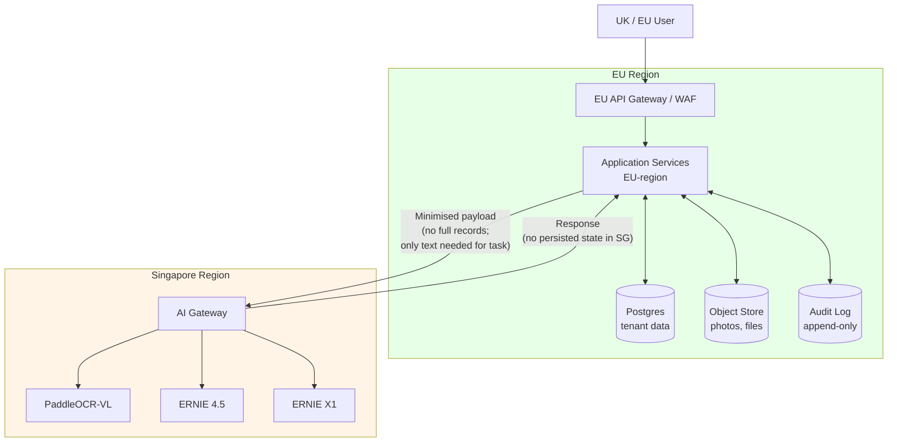

# Roomard — Solution Architecture Document v1.0

**Technical architecture for the AI guest memory engine, built on the full Baidu/MeDo stack.**

| Field | Value |
|---|---|
| Document | Roomard Solution Architecture v1.0 |
| Date | 18 May 2026 |
| Companion to | Roomard BRD v2.0, Use Case Catalogue v1.0, Use Case Flow Diagrams v1.0, User Story Backlog v1.0 |
| Tech stack constraint | Full Baidu/MeDo (MeDo, ERNIE 4.5, ERNIE X1, PaddleOCR-VL, Qianfan MaaS) |
| Audience | Engineering lead, CTO-track reviewer, security/compliance reviewer, integration partner |
| Status | Draft 1 — to be refined as architecture decisions are validated against actual Baidu region availability |

---

## 0. Document map

| Section | Purpose |
|---|---|
| 1 | Architectural principles |
| 2 | High-level component view |
| 3 | Service decomposition |
| 4 | Data architecture |
| 5 | AI/inference architecture |
| 6 | Web architecture |
| 7 | Mobile architecture |
| 8 | Integration architecture (PMS, reviews, email, SSO) |
| 9 | Security architecture |
| 10 | Data residency and compliance architecture |
| 11 | Observability and reliability |
| 12 | Deployment topology |
| 13 | Environments and CI/CD |
| 14 | Capacity and scaling assumptions |
| 15 | Architectural Decision Records (ADRs) |
| 16 | Open architecture questions |

---

## 1. Architectural principles

These principles govern every architectural decision. They are not aspirations; deviations require an ADR.

| # | Principle | Why |
|---|---|---|
| P1 | **Multi-tenant by default.** Every persistent object has a tenant ID. Row-level security enforces boundaries. | Single-tenant code paths inevitably break boundaries; designing once for many tenants is the only safe approach. |
| P2 | **Data residency before performance.** When in doubt, store EU-resident; transit minimised, not eliminated. | UK/EU buyers are the primary market and the residency conversation kills deals if not designed in. |
| P3 | **Audit-first, not audit-bolted.** Every write to Class A or B data emits an audit event in the same transaction. | Retrofitting audit logs is impossible at scale; compliance certifications require this from day one. |
| P4 | **AI is a service, not a library.** All inference calls go through a single internal abstraction. | Allows model swapping (within Qianfan), prompt versioning, observability, cost tracking, and rate limiting in one place. |
| P5 | **Eventual consistency is the default.** Strong consistency is the exception, requires explicit ADR. | Multi-source ingestion (PMS, email, reviews, cards) is intrinsically eventual; designing as strong-consistent creates fragility. |
| P6 | **Idempotent everything.** Every webhook handler, every queue consumer, every API mutation operates idempotently on a request ID or natural key. | At-least-once delivery is the norm; correctness must not depend on exactly-once. |
| P7 | **Mobile and web are peers, not parent/child.** Both consume the same API. Neither owns business logic. | A web-only or mobile-only product fails the deployment shape Roomard needs. |
| P8 | **Confidence is data.** Every AI-derived field carries a confidence score in storage. UIs and pipelines branch on it. | The product's trust story depends on surfacing AI uncertainty; this is impossible if confidence isn't a persistent field. |
| P9 | **MeDo as accelerator, not lock-in.** All business logic owned by Roomard runs outside MeDo. MeDo scaffolds the web app and orchestrates agents. | The platform constraint shouldn't trap business logic in a vendor-specific runtime. |
| P10 | **Boring tech for the boring parts.** Postgres-compatible, S3-compatible, Redis-compatible, REST/JSON, OIDC. Novelty only where it earns its keep. | Hiring, debugging, and integration friction all reward conservatism in plumbing. |

---

## 2. High-level component view



**Read this diagram top-down.** Surfaces talk only to the gateway. The gateway is the single point of authentication and rate limiting. Core services are stateless; all state lives in the data layer. The AI layer is consumed via an internal abstraction so the underlying Qianfan endpoints can be swapped per task without touching business logic.

---

## 3. Service decomposition

Roomard is decomposed into eight core services. The decomposition follows two rules: services align to use case clusters (not to nouns), and services own their data (no shared database between services beyond shared reference tables).

### 3.1 Service catalogue

| Service | Owns | Primary UCs served | Storage |
|---|---|---|---|
| **AuthSvc** | Sessions, role assignments, tenant SSO config | UC-28, UC-29 | Postgres (tenant + auth tables) |
| **TenantSvc** | Tenant lifecycle, property registry, billing reference | UC-30 | Postgres |
| **GuestSvc** | Guest profiles, preferences, evidence references, history | UC-08, UC-12, UC-14, UC-15 | Postgres + Object Store (evidence) |
| **CaptureSvc** | Card photos, voice memos, ticket photos, OCR/transcription orchestration | UC-01, UC-02, UC-04, UC-22 | Object Store + Postgres (extracted fields) |
| **IngestSvc** | PMS sync, review polling, email ingestion | UC-03a, UC-05a, UC-24a, UC-24b, UC-25 | Postgres (records) + Object Store (raw payloads) |
| **BriefSvc** | Daily arrival brief generation and distribution, prep cards, narrative summaries | UC-07a, UC-07b, UC-09, UC-12, UC-13 | Postgres |
| **ExceptionSvc** | Exception queue across all sources | UC-23 | Postgres (queue) |
| **AuditSvc** | Append-only audit log, search, export | UC-18, UC-19, UC-20, UC-21 | Append-only store (Postgres with no-update trigger + optional WORM object store mirror) |

### 3.2 Service interaction patterns

Three patterns:

**Synchronous (request/response):** Surfaces → API Gateway → service. Used for UI-driven reads and writes where the user is waiting. Target latency p99 < 1.5s.

**Asynchronous (event-driven):** Service emits event → message bus → other services subscribe. Used for cross-service propagation (e.g., `card.captured` → ExceptionSvc subscribes if confidence low; `arrival.new` → BriefSvc subscribes).

**Scheduled:** Cron-style trigger → service. Used for poll-based ingestion (UC-25), generation (UC-07a, UC-09), reconciliation (UC-24a hourly check).



### 3.3 Service boundaries — explicitly drawn

Inter-service rules:
- Services **never** read another service's database directly. Always via API or event.
- Services **may** share read-only reference tables (currency, timezone, country, property registry) but only via a centrally-managed schema in TenantSvc.
- Cross-service transactions are **not** supported. Sagas with compensating actions are the pattern for multi-service workflows (used for tenant provisioning, identity merge, RTBF purge).

### 3.4 Inside MeDo

MeDo is used in two distinct modes:

**Mode 1 — Web app scaffolding.** MeDo generates the initial React/TS web app from spec. The resulting codebase is exported, owned by Roomard, and maintained outside MeDo from day one. MeDo is not in the runtime path of the production web app.

**Mode 2 — Multi-agent orchestration.** MeDo orchestrates AI pipelines (e.g., card-capture pipeline: OCR agent → entity-extraction agent → confidence-scoring agent → exception-router agent). These pipelines run server-side, invoked by CaptureSvc, IngestSvc, BriefSvc.

This separation matters: it limits Roomard's runtime dependency on MeDo to the orchestration layer. If MeDo pricing or availability changes, only the orchestration patterns need to be reimplemented, not the entire web app.

---

## 4. Data architecture

### 4.1 Data classification (recap from BRD §15.1)

| Class | Examples | Region | Encryption | Retention |
|---|---|---|---|---|
| A — Sensitive PII | Guest name, email, phone, dietary, religious, health-adjacent | EU-resident only | AES-256 at rest + TLS 1.3 in transit + per-tenant key | 7 years post last stay, or until verified deletion request |
| B — Behavioural | Stay history, complaint history, preference tags | EU-resident only | AES-256 + per-tenant key | 7 years |
| C — Operational | Audit logs, system events | EU-resident, append-only | AES-256 | 7 years (regulatory minimum) |
| D — Aggregate / Anonymised | Network benchmarks | Inference region acceptable | AES-256 | Indefinite |

### 4.2 Core data entities

| Entity | Cardinality | Notes |
|---|---|---|
| Tenant | 1 per group | Top-level boundary |
| Property | N per tenant | Where the work happens |
| User | N per tenant | Staff |
| Role | Predefined + customisable | RBAC |
| Guest | N per tenant | Cross-property within tenant |
| Stay | N per guest | PMS-sourced |
| Preference | N per guest | Multi-source, with confidence + evidence |
| Evidence | N per preference | Source records: card photo, email snippet, review excerpt, voice memo |
| Issue | N per stay | Complaints, maintenance, F&B |
| Review | N per guest (linked) or unlinked | External-platform-sourced |
| Brief | 1 per property per day | UC-07 output |
| PrepCard | 1 per room per arrival | UC-09 output |
| ExceptionItem | N | Pending human review |
| AuditEvent | N | Every state change |

### 4.3 Preference entity — the spine of the product

The Preference entity is worth singling out because it's where the product's IP lives.

```
Preference {
  id: UUID
  tenant_id: UUID
  guest_id: UUID
  type: enum (pillow, temperature, dietary, allergy, room_position, ...)
  polarity: enum (likes, dislikes, requires, avoids)
  detail: text
  confidence: float 0..1
  source_evidence_ids: [UUID]   // pointers to Evidence records
  first_seen_at: timestamp
  last_seen_at: timestamp
  last_confirmed_at: timestamp | null   // when human confirmed
  superseded_by: UUID | null    // when corrected
  superseded_at: timestamp | null
  metadata: jsonb
}
```

A preference is **never deleted** except by RTBF. It can be superseded (a newer preference overrides it), but the history is retained for audit and trajectory analysis. This is critical for the "your guest's preferences have changed" narrative.

### 4.4 ERD (high-level)



The full ERD (with all fields, indexes, and constraints) is in a separate Data Model & ERD document — that's Document 6 in this series.

### 4.5 Storage choices per data class

| Storage | Purpose | Class | Region |
|---|---|---|---|
| Postgres-compatible (Baidu RDS for PostgreSQL, EU region if available; else AWS RDS Frankfurt — see §10.2) | Structured tenant data (Guest, Preference, Stay, Issue, Brief, PrepCard, ExceptionItem) | A, B | EU |
| Object Store (Baidu BOS if EU edge; else AWS S3 Frankfurt) | Photos, voice memos, raw emails, audit pack exports | A, B | EU |
| Append-only Postgres + WORM mirror | Audit log | C | EU |
| Search index (Elastic-compatible) | Guest search, review search | A (indexed text, encrypted) | EU |
| Cache (Redis-compatible) | Session, hot reads, rate-limit counters | (non-persistent; A-equivalent if cached) | EU |
| Inference cache | Cached AI outputs (where deterministic) | D | Inference region |

### 4.6 Per-tenant data isolation

Two layers of isolation:

**Layer 1 — Row-level security (RLS) at the database.** Every table containing tenant data has a `tenant_id` column. RLS policies attached to every role enforce that queries can only return rows where `tenant_id = current_setting('app.tenant_id')`. The session variable is set by AuthSvc on every connection.

**Layer 2 — Application-level tenant boundary check.** Every API request passes through a middleware that verifies the tenant context matches the user's tenant. Double-defence: if RLS misconfiguration ever happens, the application layer blocks the cross-tenant access.

For object storage, each tenant has its own bucket (or bucket prefix with IAM policy). Cross-tenant object access is structurally impossible.

For Class A enterprise customers requiring even stronger isolation, an Enterprise-tier feature can deploy per-tenant database instances. This is opt-in and priced separately.

---

## 5. AI / inference architecture

### 5.1 Why an internal abstraction

The architectural principle P4 — "AI is a service, not a library" — manifests as an internal AI Gateway. Every inference call in the system goes through this gateway. Why:

- **Task-level swapping.** If ERNIE 4.5 underperforms on UK English (see BRD §16.2), specific tasks can be routed to alternative models accessible through Qianfan without touching business logic.
- **Prompt versioning.** Prompts are first-class versioned artefacts. Rolling back a prompt change is a deployment, not a code change.
- **Confidence calibration.** Confidence scores from different models are normalised to a common scale at the gateway.
- **Observability.** Every inference call is logged: prompt template ID, model, latency, token cost, confidence output, downstream consumer. This data drives cost optimisation and quality monitoring.
- **Rate limiting.** Per-tenant rate limits prevent one noisy tenant from starving others.
- **Caching.** Deterministic outputs (e.g., the same review summarised the same way) are cached.
- **Audit.** Every AI call is audit-logged with the same rigour as data writes.

### 5.2 AI Gateway architecture



### 5.3 Pipeline pattern — card capture as canonical example

The card capture pipeline (UC-01) is the canonical multi-step AI workflow. Other pipelines (email extraction, review linking, brief generation) follow the same pattern.



This pipeline is orchestrated in MeDo. Each agent is a discrete invocation of the AI Gateway. The orchestration is replayable on failure and observable at every step.

### 5.4 Prompt management

Prompts are versioned in a Prompt Registry (stored in Postgres). Each prompt has:
- ID, version, status (draft / active / deprecated)
- Template (parameterised text)
- Model binding (which Qianfan endpoint)
- Quality benchmark scores (precision, recall, F1 on labelled dataset)
- Approval audit trail

Production traffic uses **active** prompts only. New prompts move through draft → A/B candidate → active → deprecated lifecycle. Rolling back a prompt is a configuration change, not a deploy.

### 5.5 Data minimisation at the inference boundary

A strict rule per principle P2: **the inference layer sees only what it needs**.

- For OCR of a card: only the image is sent.
- For entity extraction from a card's OCR output: only the OCR text is sent — not the matched booking, not the guest's other preferences.
- For brief generation: a structured digest of preferences and history is sent — not raw evidence files.
- For review-to-guest matching: only the review text and a list of candidate stays (date, room, partial name) is sent — not full guest records.

This minimisation is enforced at the AI Gateway. Calling code passes the full context; the gateway extracts only what the prompt template requires. Audit logs record exactly what was sent.

This is the engineering work that makes the cross-region inference acceptable to UK/EU buyers (see §10).

---

## 6. Web architecture

### 6.1 Stack

| Layer | Choice | Why |
|---|---|---|
| Framework | React + TypeScript | Industry standard, MeDo generation target, deep talent pool |
| Routing | TanStack Router | Type-safe routing |
| State | TanStack Query + Zustand | Server state vs UI state cleanly split |
| Component library | shadcn/ui + Tailwind | Fast iteration, accessible, no licensing issues |
| Forms | React Hook Form + Zod | Schema-shared with backend |
| Build | Vite | Fast, well-supported |
| Auth | OIDC client | Standard, IdP-agnostic |

### 6.2 Web app structure

```
roomard-web/
├── apps/
│   └── web/                  # The web app
├── packages/
│   ├── ui/                   # Shared component library
│   ├── api-client/           # Generated from OpenAPI spec
│   ├── schemas/              # Zod schemas, shared with backend
│   └── utils/                # Shared utilities
└── tools/
    └── codegen/              # API client generation
```

### 6.3 Surface-role mapping (web)

The web app is the primary surface for: Admin, GM, VP, DPO, Concierge (review-heavy work), F&B Manager. It is the fallback surface for Front Desk Manager and Front Desk Agent.

Surface-specific routes:
- `/admin/*` — Admin, Tenant Admin
- `/group/*` — GM, Brand Director, VP
- `/property/*` — Property-level operations
- `/concierge/*` — Concierge work surface
- `/compliance/*` — DPO, Auditor
- `/briefs/today` — Brief view (shared with mobile)

### 6.4 Web performance budget

| Metric | Target |
|---|---|
| Initial load (cold) | ≤ 3 seconds on 4G |
| Initial load (warm, cached) | ≤ 1 second |
| Brief view first paint | ≤ 1 second |
| Search results render | ≤ 800ms |
| Largest Contentful Paint | ≤ 2.5 seconds |

---

## 7. Mobile architecture

### 7.1 Phase 1 — PWA

Phase 1 mobile is a Progressive Web App, sharing 70%+ of the React codebase with the web app via shared packages.

PWA capabilities Roomard relies on:
- Service worker for offline support
- Background sync for queued offline actions
- Push notifications (with limitations — see §7.3)
- Camera access via `navigator.mediaDevices.getUserMedia`
- IndexedDB for local cache

### 7.2 Phase 2 — React Native (camera-heavy paths only)

If PWA camera OCR quality falls below the threshold (target: OCR confidence ≥ 0.80 on UK benchmark, see UC-01 AC-01.2), camera-heavy use cases (UC-01, UC-02) migrate to React Native. Non-camera paths remain PWA.

Decision gate: end of Sprint 3 (after first OCR benchmark run with real cards).

### 7.3 Push notification reliability

PWAs have well-documented push reliability issues on iOS (more limited than Android). For UC-07b (brief distribution) where reliable morning push is critical:

- Primary: Web Push API where supported
- Secondary: Email fallback at 06:45 if push not acknowledged by 06:35
- Tertiary: SMS fallback for the property's designated FD Manager phone (paid feature; opt-in)

Push reliability target: ≥ 95% delivery within 5 minutes on the designated device. Below that, email is the source of truth.

### 7.4 Offline architecture

Local storage on mobile:
- Today's arrivals (full profile compact view) — refreshed on each login + every 30 minutes when online
- Last 7 days of arrivals — for lookup of recently-departed guests
- Pending captures (cards, voice memos) — queue with retry, max 50 items
- User's exception queue items — read-only cache

Conflict handling on sync: server is authoritative for data writes; client-side conflict-detection alerts the user if a server-side change to the same record occurred during offline time.

---

## 8. Integration architecture

### 8.1 PMS integration (Mews flagship)



Mews integration specifics:
- Webhook subscription on tenant onboarding
- OAuth2-based authentication for API calls
- Rate limits respected with exponential backoff
- Mews API version pinned per tenant; upgrades require ADR

Other PMS integrations (Cloudbeds, Opera Cloud OHIP, Apaleo) follow the same pattern with PMS-specific adapters behind a common interface. Adapter pattern keeps IngestSvc PMS-agnostic.

### 8.2 Review platform integration

| Platform | Method | Notes |
|---|---|---|
| TripAdvisor | Partner API (requires partnership agreement) | Higher quality data; partnership delay 4–8 weeks |
| Booking.com | Hotel APIs (requires hotel access) | Property owner consent required |
| Google Business | My Business API | Most accessible; lowest data richness |

All review platforms poll every 2 hours via UC-25.

### 8.3 Email integration (V2)

| Provider | Method |
|---|---|
| Microsoft 365 | Graph API + change notifications |
| Google Workspace | Gmail API + push notifications |

OAuth-based authentication per mailbox. Tenant Admin grants consent. Roomard reads only mailboxes explicitly authorised. Email body sent to AI Gateway is minimised per §5.5.

### 8.4 SSO integration

Standard SAML 2.0 and OIDC. IdPs supported out of the box:
- Microsoft Entra ID (formerly Azure AD)
- Okta
- Google Workspace
- Auth0
- OneLogin

JIT (Just-In-Time) provisioning: users created on first login with default role per tenant config. SCIM (System for Cross-domain Identity Management) for full lifecycle management — V2.

---

## 9. Security architecture

### 9.1 Trust boundaries



### 9.2 Authentication and authorisation

Authentication: SSO (preferred) or username + password + MFA (fallback for property-tier customers without SSO). Sessions are JWT-based, short-lived (1 hour), with refresh tokens (24 hours, rotating).

Authorisation: Role-based access control (RBAC) with per-resource scopes. Permissions are checked at the API Gateway (coarse-grained) and again at the service layer (fine-grained, resource-aware).

Sensitive operations (purge, audit export, role changes) require MFA re-authentication regardless of session age.

### 9.3 Encryption

- **At rest:** AES-256 across all storage (Postgres, object store, audit log). Per-tenant key derivation under a tenant master key. Tenant master keys stored in a KMS-equivalent (Baidu KMS or AWS KMS depending on storage region).
- **In transit:** TLS 1.3 for all public-facing traffic. mTLS for internal service-to-service traffic. End-to-end inside our boundary.

### 9.4 Secret management

No secrets in code or environment variables. Secrets manager (Baidu Secrets Manager or AWS Secrets Manager) holds: database credentials, API keys, OAuth client secrets, encryption keys. Services pull at startup with workload identity authentication.

### 9.5 Security audit and testing

| Activity | Cadence |
|---|---|
| Automated SCA (software composition analysis) | Every PR |
| SAST (static analysis) | Every PR |
| Dependency vulnerability scanning | Daily |
| DAST (dynamic analysis) | Weekly on staging |
| Third-party penetration test | Pre-MVP cutover, then annually |
| Internal red-team exercise | Annually |
| Tabletop incident response | Quarterly |

---

## 10. Data residency and compliance architecture

### 10.1 The constraint, restated

UK/EU customers require guest data (Class A and B) to be EU-resident, or covered by SCCs with documented adequacy. Baidu AI Cloud does not have a confirmed EU production region as of the architecture-decision date (May 2026). This constraint shapes §10.2.

### 10.2 The pattern: EU-resident storage + Singapore-region inference, data-minimised transit



Key properties:
- **Class A and B PII never persists outside EU.** Inference responses are stored back in EU; nothing remains in Singapore.
- **Transit is data-minimised.** Per §5.5, only the text needed for the inference task is sent.
- **Contractual chain.** Customer → Roomard (DPA, EU controller) → Baidu (sub-processor, SCCs).
- **Enterprise opt-out.** Customers requiring zero cross-border transit can deploy a private-region inference cluster on Qianfan's on-premises offering (Enterprise tier).

### 10.3 If Baidu opens an EU region (likely within 18 months)

Architecture is designed to migrate cleanly: AI Gateway routing config changes; data layer remains in EU. Migration is a configuration change, not a re-architecture.

### 10.4 GDPR-specific architecture

| Right | Architecture support |
|---|---|
| Right to access (Art. 15) | UC-18a / UC-18b — DPO surface and guest panel; export pack generation |
| Right to rectification (Art. 16) | UC-14 — preference correction; audit-logged |
| Right to erasure (Art. 17) | UC-19 — cascading async purge with verification report and tombstone audit record |
| Right to restriction (Art. 18) | Per-record processing flag; respected by all consuming services |
| Right to portability (Art. 20) | UC-18 export pack is machine-readable (JSON + signed PDF) |
| Right to object (Art. 21) | Tenant-level config to disable specific processing categories |

---

## 11. Observability and reliability

### 11.1 The three pillars

**Logs.** Structured JSON logs from every service. Tenant ID, correlation ID, user ID, operation, latency, outcome on every log line. Sensitive fields redacted.

**Metrics.** Prometheus-compatible. Service-level (request rate, error rate, latency p50/p95/p99), business-level (briefs generated, captures processed, exception queue depth), AI-level (inference calls, cost per tenant, prompt-version usage).

**Traces.** OpenTelemetry. Distributed traces from API Gateway through services through AI Gateway to inference endpoints. Sampling at 10% baseline, 100% on error.

### 11.2 SLOs (Service Level Objectives)

| SLO | Target | Window |
|---|---|---|
| API Gateway availability | 99.9% | 30-day rolling |
| Guest lookup latency p99 (UC-08) | < 1.5s | 7-day rolling |
| Brief generation latency p99 (UC-07a) | < 5 minutes from trigger | 7-day rolling |
| Brief on-time delivery (UC-07b by 06:30) | 99% of mornings | 30-day rolling |
| PMS sync event lag p99 | < 60 seconds | 7-day rolling |
| Card OCR latency p99 | < 8 seconds | 7-day rolling |
| Review polling success rate | ≥ 98% successful polls per platform | 7-day rolling |
| AI inference success rate | ≥ 99% non-error responses | 7-day rolling |

Error budget burn-rate alerts at 2x and 10x. Pages the on-call.

### 11.3 Incident response

On-call rotation post-Sprint 6. Runbooks for: PMS sync stall, inference outage, audit log corruption (severe), tenant data leak (severe), authentication outage. Tabletop quarterly.

### 11.4 Backups and disaster recovery

| RPO | RTO | What |
|---|---|---|
| 5 minutes | 1 hour | Postgres (point-in-time recovery + cross-AZ replication) |
| 24 hours | 4 hours | Object store (cross-region replication EU-EU) |
| 1 hour | 1 hour | Audit log (cross-AZ replication, WORM mirror) |
| 24 hours | 8 hours | Full system restoration to a clean region from backups |

DR drill quarterly.

---

## 12. Deployment topology

### 12.1 Regions

| Region | Role | What runs there |
|---|---|---|
| **EU (primary)** | Production for EU/UK customers | All tenant data (A, B, C), application services, audit, EU CDN edges |
| **Singapore** | Inference | Qianfan endpoints (OCR, LLM, reasoning); MeDo orchestration |
| **Future: Baidu EU** | Inference (when available) | Migration target; reduces transit |

### 12.2 Kubernetes layout (notional)

| Namespace | Purpose |
|---|---|
| `roomard-core` | Auth, Tenant, Guest, Capture, Ingest, Brief, Exception, Audit services |
| `roomard-ai-gw` | AI Gateway (sidecar to core, routes to inference region) |
| `roomard-edge` | API Gateway, WAF rules |
| `roomard-data` | Operators for Postgres, Redis, search (managed where possible) |
| `roomard-obs` | Observability stack (Prometheus, OTel collector, Loki/equivalent) |
| `roomard-ops` | Internal admin tools, CI runners |

### 12.3 Mobile distribution

- Phase 1 PWA: served from web app; installable from browser
- Phase 2 React Native: distributed via App Store and Play Store under Roomard publisher account

---

## 13. Environments and CI/CD

### 13.1 Environments

| Environment | Purpose | Data |
|---|---|---|
| `dev` | Engineer local + ephemeral PR previews | Synthetic seed data |
| `staging` | Pre-production integration testing | Synthetic data, mirror of prod schema |
| `pilot` | First customer pilots, isolated tenant | Real customer data, prod-grade SLOs |
| `prod` | Production multi-tenant | Real customer data |

### 13.2 CI/CD pipeline

```mermaid
flowchart LR
    A[PR opened] --> B[CI: lint, test, build]
    B --> C[Static analysis<br/>SAST + SCA]
    C --> D[Ephemeral PR preview env]
    D --> E[Code review]
    E --> F[Merge to main]
    F --> G[Deploy to staging]
    G --> H[Integration tests<br/>+ smoke tests]
    H --> I[Manual gate]
    I --> J[Deploy to pilot]
    J --> K[Soak 24 hours]
    K --> L[Manual gate]
    L --> M[Deploy to prod<br/>canary 10% → 50% → 100%]
```



Target: every merge reaches prod within 7 days (with manual gates), every hotfix within 4 hours.

---

## 14. Capacity and scaling assumptions

### 14.1 Year-1 capacity targets

| Metric | Year-1 target |
|---|---|
| Tenants (paying) | 50 |
| Properties | 1,200 |
| Active users | 8,000 |
| Concurrent users at peak (07:00 local across regions) | 600 |
| Daily briefs generated | 1,200 |
| Daily card captures | 4,000 |
| Daily reviews ingested | 600 |
| Inference calls per day | 25,000 |
| Storage (tenant data, year-1) | ~500 GB |
| Storage (audit log, year-1) | ~150 GB |
| Storage (object store, year-1) | ~2 TB |

### 14.2 Scaling approach

- **Stateless services horizontally scaled.** All core services run as multiple replicas behind a load balancer. Scale out by adding replicas; no shared state.
- **Postgres scaled vertically until ~50% utilisation, then sharded by tenant.** Sharding strategy: tenant ID hash; deferred to Year-2.
- **Object store scales naturally.**
- **AI Gateway scales independently** of core services; can handle bursty inference loads with rate limiting per tenant.

---

## 15. Architectural Decision Records (ADRs) — initial set

ADRs document significant architectural decisions with context, decision, and consequences. The full ADR repository is maintained in `/docs/adr/`. The initial set:

| ADR | Title | Decision |
|---|---|---|
| ADR-001 | Use MeDo for scaffolding, not runtime | MeDo scaffolds web app and orchestrates AI pipelines; production runtime is independent React/TS deployment |
| ADR-002 | Postgres-compatible RDBMS for tenant data | Postgres on Baidu RDS if EU region available, else AWS RDS Frankfurt under SCCs |
| ADR-003 | Multi-tenant via RLS + application boundary check | Two-layer isolation; per-tenant DB only on Enterprise tier |
| ADR-004 | PWA-first mobile, React Native if needed | Defer React Native decision to end of Sprint 3 based on OCR benchmark |
| ADR-005 | AI Gateway as single inference abstraction | All inference goes through gateway; no direct Qianfan calls from services |
| ADR-006 | Data-minimised cross-border transit for inference | Send only task-required text; never persist outside EU |
| ADR-007 | Mews as flagship PMS integration | First PMS integration; certified Mews app target within 6 months |
| ADR-008 | Audit log append-only with WORM mirror | Postgres append-only + object-store WORM mirror; tamper-evident |
| ADR-009 | SAML + OIDC for SSO, supporting Entra/Okta/Google | Standard protocols; JIT provisioning; SCIM in V2 |
| ADR-010 | Confidence is a first-class persistent field | Every AI-derived field stores its confidence; UIs and pipelines branch on it |

---

## 16. Open architecture questions

These need resolution before architectural assumptions in this document are locked.

| ID | Question | Owner | Resolution target |
|---|---|---|---|
| AQ-01 | Is Baidu RDS for PostgreSQL available in an EU-equivalent region with SCC coverage? | Senthil + Baidu support | Pre-Sprint 0 |
| AQ-02 | Is Baidu BOS available with EU-resident edge for production? | Senthil + Baidu support | Pre-Sprint 0 |
| AQ-03 | Mews API certification process timeline and gating requirements | Roomard ops | Sprint 2 |
| AQ-04 | PWA push notification reliability on iOS — actual measured rate vs Apple's published guidance | Engineering | Sprint 5 |
| AQ-05 | UK English benchmark dataset acquisition — partnerships with hotels for labelled data | Senthil + Customer Success | Pre-Sprint 3 |
| AQ-06 | MeDo code-export licensing — confirm the exported code is unrestricted for production use | Legal | Pre-Sprint 1 |
| AQ-07 | Qianfan rate limits — confirm per-account limits accommodate Year-1 capacity targets | Engineering | Sprint 2 |
| AQ-08 | Audit log WORM mirror — Baidu equivalent of S3 Object Lock, or use AWS S3 Frankfurt | Engineering + Compliance | Sprint 4 |

---

## 17. What this document does *not* cover

| Topic | Deferred to |
|---|---|
| Full data model with every field and constraint | Data Model & ERD (Document 6) |
| API request/response shapes per endpoint | API Contract Specification (Document 7) |
| Traceability matrix and update protocol | Traceability Matrix (Document 8) |
| Test strategy and test case skeleton | Test Strategy (Document 9) |
| Sprint sequencing detail | Sprint Plan (Document 10) |
| UI design system, design tokens | (Separate design track) |
| Marketing site architecture | (Out of scope) |

---

## 18. Document control

| Version | Date | Author | Changes |
|---|---|---|---|
| 1.0 | 18 May 2026 | Senthil with Claude | Initial architecture; 10 ADRs; 8 open questions for resolution |

---

*End of Roomard Solution Architecture Document v1.0 — 18 May 2026.*
