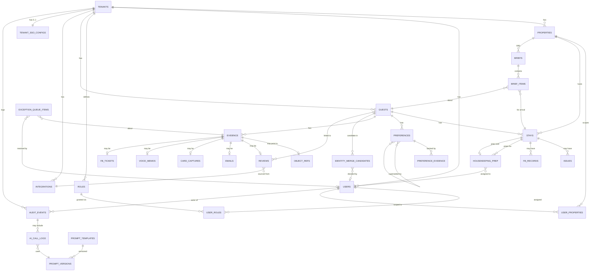

# Roomard — Data Model & ERD v1.0

**Full entity-relationship model with table specifications, indexes, constraints, RLS policies, and audit triggers.**

| Field | Value |
|---|---|
| Document | Roomard Data Model & ERD v1.0 |
| Date | 18 May 2026 |
| Companion to | Roomard BRD v2.0, Use Case Catalogue v1.0, Solution Architecture v1.0 |
| DB engine | PostgreSQL 16 (Baidu RDS for PostgreSQL EU region if available; AWS RDS Frankfurt fallback) |
| Audience | Engineers writing migrations, DBAs, security/compliance reviewers |
| Scope | MVP + V2 entities (all entities referenced in UC-01 through UC-30) |

---

## 0. Document map

| Section | Purpose |
|---|---|
| 1 | Modelling conventions |
| 2 | Full ERD |
| 3 | Tenant & access entities |
| 4 | Property & infrastructure entities |
| 5 | Guest, stay, preference entities |
| 6 | Evidence & source entities |
| 7 | Brief & prep entities |
| 8 | Exception queue entity |
| 9 | Review entities |
| 10 | Audit log entities |
| 11 | AI / prompt registry entities |
| 12 | Row-level security policies |
| 13 | Indexing strategy |
| 14 | Audit trigger pattern |
| 15 | Migration approach |
| 16 | Open data-model questions |

---

## 1. Modelling conventions

These conventions apply to every table. Deviations require ADR.

| Convention | Detail |
|---|---|
| **Primary keys** | UUID v7 (time-ordered) for all tables. Generated server-side. Never client-supplied. |
| **Tenant ID** | `tenant_id UUID NOT NULL` on every table containing tenant data. First column after `id`. |
| **Timestamps** | Every table has `created_at`, `updated_at`. Stored as `TIMESTAMPTZ`. UTC. |
| **Soft deletes** | `deleted_at TIMESTAMPTZ NULL` where soft delete applies. Hard delete only via RTBF purge (UC-19). |
| **Audit fields** | `created_by UUID`, `updated_by UUID` referencing `users.id`. NULL allowed for system-generated rows (with `created_by_system TEXT` capturing the system name). |
| **Enums** | Use Postgres native ENUM types, declared in dedicated migration. Avoid string-typed status columns. |
| **JSON** | Use `JSONB`, never `JSON`. Validate shape in application; index frequently-queried paths. |
| **Naming** | `snake_case` for tables and columns. Tables plural (`guests`), join tables hyphenated (`guests_tags`). |
| **Foreign keys** | Always declared with `ON DELETE` action explicit. Default `RESTRICT`; `CASCADE` only for parent-owned data. |
| **Indexes** | Every foreign key indexed. Composite indexes for common query patterns (tenant_id + frequently-filtered column). |
| **RLS** | Enabled on every tenant-data table. Policy enforces `tenant_id = current_setting('app.tenant_id')::uuid`. |

---

## 2. Full ERD

The full entity-relationship diagram, showing primary relationships:



The diagram above is intentionally simplified for readability. Sections 3–11 below specify every table with its full column list.

---

## 3. Tenant & access entities

### 3.1 `tenants`

The root tenancy boundary. One row per paying customer group.

| Column | Type | Constraints | Notes |
|---|---|---|---|
| `id` | UUID | PK | Tenant identifier; used as `tenant_id` everywhere |
| `name` | TEXT | NOT NULL | Display name (e.g. "Pestana Hotels") |
| `slug` | TEXT | UNIQUE, NOT NULL | URL-safe identifier |
| `tier` | tenant_tier | NOT NULL | ENUM: `property`, `group_starter`, `group`, `enterprise` |
| `billing_reference` | TEXT | NULL | Stripe customer ID or equivalent |
| `data_residency` | data_residency | NOT NULL | ENUM: `eu`, `apac`, `dedicated`; controls bucket and DB routing |
| `status` | tenant_status | NOT NULL | ENUM: `provisioning`, `active`, `suspended`, `closed` |
| `contract_start_at` | TIMESTAMPTZ | NOT NULL | |
| `contract_end_at` | TIMESTAMPTZ | NULL | NULL = open-ended |
| `metadata` | JSONB | DEFAULT `'{}'` | Tenant-specific flags |
| `created_at` | TIMESTAMPTZ | NOT NULL, DEFAULT now() | |
| `updated_at` | TIMESTAMPTZ | NOT NULL, DEFAULT now() | |
| `created_by_system` | TEXT | NULL | Provisioning source |

**Indexes:**
- `(slug)` UNIQUE
- `(status)` partial WHERE status = 'active'

**RLS:** Tenants table itself is **not** RLS-protected — only platform-admin role accesses it directly. Application services receive the tenant ID from the auth layer.

### 3.2 `tenant_sso_configs`

Per-tenant SSO configuration. Zero or one row per tenant.

| Column | Type | Constraints | Notes |
|---|---|---|---|
| `tenant_id` | UUID | PK, FK tenants(id) ON DELETE CASCADE | One config per tenant |
| `protocol` | sso_protocol | NOT NULL | ENUM: `saml`, `oidc` |
| `idp_entity_id` | TEXT | NOT NULL | Customer IdP identifier |
| `idp_metadata_url` | TEXT | NULL | For dynamic metadata |
| `idp_metadata_xml` | TEXT | NULL | For static metadata |
| `attribute_mapping` | JSONB | NOT NULL | Maps IdP claims to Roomard user attributes |
| `default_role_id` | UUID | NOT NULL, FK roles(id) | JIT-provisioned users get this role |
| `jit_provisioning` | BOOLEAN | NOT NULL, DEFAULT true | |
| `enforce_sso` | BOOLEAN | NOT NULL, DEFAULT false | If true, password login disabled |
| `created_at` | TIMESTAMPTZ | NOT NULL, DEFAULT now() | |
| `updated_at` | TIMESTAMPTZ | NOT NULL, DEFAULT now() | |

### 3.3 `users`

Staff users of the tenant.

| Column | Type | Constraints | Notes |
|---|---|---|---|
| `id` | UUID | PK | |
| `tenant_id` | UUID | NOT NULL, FK tenants(id) ON DELETE RESTRICT | |
| `email` | TEXT | NOT NULL | Lowercase enforced |
| `display_name` | TEXT | NOT NULL | |
| `external_id` | TEXT | NULL | From IdP (sub claim) |
| `status` | user_status | NOT NULL | ENUM: `invited`, `active`, `suspended`, `deleted` |
| `last_login_at` | TIMESTAMPTZ | NULL | |
| `mfa_enrolled` | BOOLEAN | NOT NULL, DEFAULT false | |
| `metadata` | JSONB | DEFAULT `'{}'` | |
| `created_at` | TIMESTAMPTZ | NOT NULL, DEFAULT now() | |
| `updated_at` | TIMESTAMPTZ | NOT NULL, DEFAULT now() | |
| `created_by` | UUID | NULL, FK users(id) | NULL for SSO JIT |
| `deleted_at` | TIMESTAMPTZ | NULL | Soft delete |

**Indexes:**
- `(tenant_id, email)` UNIQUE WHERE deleted_at IS NULL
- `(tenant_id, external_id)` UNIQUE WHERE external_id IS NOT NULL AND deleted_at IS NULL
- `(tenant_id, status)`

### 3.4 `roles`

Predefined and custom roles per tenant.

| Column | Type | Constraints | Notes |
|---|---|---|---|
| `id` | UUID | PK | |
| `tenant_id` | UUID | NOT NULL, FK tenants(id) | NULL for global out-of-box roles |
| `name` | TEXT | NOT NULL | e.g. `front_desk_manager` |
| `display_name` | TEXT | NOT NULL | e.g. "Front Desk Manager" |
| `description` | TEXT | NULL | |
| `is_system_role` | BOOLEAN | NOT NULL, DEFAULT false | Out-of-box roles cannot be edited |
| `permissions` | JSONB | NOT NULL | Permission grants (see §3.6) |
| `created_at` | TIMESTAMPTZ | NOT NULL, DEFAULT now() | |
| `updated_at` | TIMESTAMPTZ | NOT NULL, DEFAULT now() | |

**Indexes:**
- `(tenant_id, name)` UNIQUE WHERE tenant_id IS NOT NULL
- `(is_system_role)` partial

**Seeded roles (`is_system_role = true`, tenant_id NULL):**
- `admin`, `gm`, `vp_guest_experience`, `front_desk_manager`, `front_desk_agent`, `concierge`, `housekeeping_supervisor`, `housekeeper`, `fb_manager`, `dpo`, `auditor`

### 3.5 `user_roles`

Many-to-many: a user can hold multiple roles (e.g., Front Desk Manager at one property, Concierge at another).

| Column | Type | Constraints | Notes |
|---|---|---|---|
| `id` | UUID | PK | |
| `tenant_id` | UUID | NOT NULL, FK tenants(id) | |
| `user_id` | UUID | NOT NULL, FK users(id) ON DELETE CASCADE | |
| `role_id` | UUID | NOT NULL, FK roles(id) ON DELETE RESTRICT | |
| `granted_at` | TIMESTAMPTZ | NOT NULL, DEFAULT now() | |
| `granted_by` | UUID | NOT NULL, FK users(id) | |
| `expires_at` | TIMESTAMPTZ | NULL | For temporary grants |

**Indexes:**
- `(user_id, role_id)` UNIQUE
- `(tenant_id, role_id)`

### 3.6 Permissions schema (within `roles.permissions`)

Permissions are a JSONB structure:

```json
{
  "guests": ["read", "write"],
  "preferences": ["read", "write", "delete"],
  "briefs": ["read", "annotate"],
  "audit_log": ["read"],
  "purge": [],
  "tenant_admin": [],
  "data_classes": ["A", "B", "C"]
}
```

Each top-level key is a resource type; the value is an array of action verbs the role can perform. `data_classes` controls which data classification levels (per BRD §15.1) the role can access. Application middleware reads this on every request.

### 3.7 `user_properties`

Many-to-many: scopes a user to specific properties.

| Column | Type | Constraints | Notes |
|---|---|---|---|
| `id` | UUID | PK | |
| `tenant_id` | UUID | NOT NULL, FK tenants(id) | |
| `user_id` | UUID | NOT NULL, FK users(id) ON DELETE CASCADE | |
| `property_id` | UUID | NOT NULL, FK properties(id) ON DELETE CASCADE | |
| `created_at` | TIMESTAMPTZ | NOT NULL, DEFAULT now() | |

**Indexes:**
- `(user_id, property_id)` UNIQUE
- `(tenant_id, property_id)`

Special case: users with `is_group_scope = true` on at least one role assignment access all properties in the tenant; `user_properties` rows are not required for them.

---

## 4. Property & infrastructure entities

### 4.1 `properties`

Individual hotel properties.

| Column | Type | Constraints | Notes |
|---|---|---|---|
| `id` | UUID | PK | |
| `tenant_id` | UUID | NOT NULL, FK tenants(id) ON DELETE CASCADE | |
| `name` | TEXT | NOT NULL | e.g. "Pestana London Riverside" |
| `slug` | TEXT | NOT NULL | URL-safe |
| `address` | JSONB | NOT NULL | Structured address |
| `country_code` | TEXT | NOT NULL | ISO 3166-1 alpha-2 |
| `timezone` | TEXT | NOT NULL | IANA timezone (e.g. "Europe/London") |
| `pms_provider` | pms_provider | NULL | ENUM: `mews`, `cloudbeds`, `opera_cloud`, `apaleo`, `other` |
| `pms_property_id` | TEXT | NULL | External ID at the PMS |
| `room_count` | INT | NULL | |
| `brand` | TEXT | NULL | Within tenant, multiple brands possible |
| `status` | property_status | NOT NULL | ENUM: `pre_launch`, `active`, `paused`, `archived` |
| `created_at` | TIMESTAMPTZ | NOT NULL, DEFAULT now() | |
| `updated_at` | TIMESTAMPTZ | NOT NULL, DEFAULT now() | |

**Indexes:**
- `(tenant_id, slug)` UNIQUE
- `(pms_provider, pms_property_id)` UNIQUE WHERE pms_provider IS NOT NULL
- `(tenant_id, status)`

### 4.2 `integrations`

Per-tenant connection to external systems (PMS, review platforms, email).

| Column | Type | Constraints | Notes |
|---|---|---|---|
| `id` | UUID | PK | |
| `tenant_id` | UUID | NOT NULL, FK tenants(id) ON DELETE CASCADE | |
| `property_id` | UUID | NULL, FK properties(id) ON DELETE CASCADE | NULL for tenant-wide integrations |
| `kind` | integration_kind | NOT NULL | ENUM: `pms`, `review_tripadvisor`, `review_booking`, `review_google`, `email_m365`, `email_google` |
| `provider` | TEXT | NOT NULL | e.g. `mews`, `tripadvisor` |
| `status` | integration_status | NOT NULL | ENUM: `pending`, `active`, `error`, `disabled` |
| `credentials_ref` | TEXT | NOT NULL | Reference to secrets manager, never raw creds |
| `config` | JSONB | NOT NULL, DEFAULT `'{}'` | Provider-specific config |
| `last_sync_at` | TIMESTAMPTZ | NULL | |
| `last_sync_status` | TEXT | NULL | |
| `created_at` | TIMESTAMPTZ | NOT NULL, DEFAULT now() | |
| `updated_at` | TIMESTAMPTZ | NOT NULL, DEFAULT now() | |

**Indexes:**
- `(tenant_id, kind, property_id)` UNIQUE WHERE property_id IS NOT NULL
- `(tenant_id, kind)` UNIQUE WHERE property_id IS NULL
- `(status)` partial WHERE status = 'error'

---

## 5. Guest, stay, preference entities

### 5.1 `guests`

The longitudinal guest entity. One row per natural-person guest within a tenant. Cross-property identity resolution (UC-06) merges duplicate rows into one.

| Column | Type | Constraints | Notes |
|---|---|---|---|
| `id` | UUID | PK | Stable across stays and properties |
| `tenant_id` | UUID | NOT NULL, FK tenants(id) ON DELETE CASCADE | |
| `display_name` | TEXT | NULL | Most recent name observed |
| `email_lower` | TEXT | NULL | Most recent email, lowercased |
| `phone_e164` | TEXT | NULL | E.164 format |
| `home_country_code` | TEXT | NULL | ISO 3166-1 alpha-2 |
| `home_postcode` | TEXT | NULL | Used for identity matching |
| `date_of_birth` | DATE | NULL | Optional; consent-dependent |
| `name_variants` | TEXT[] | DEFAULT `'{}'` | All observed name spellings |
| `pms_guest_ids` | JSONB | DEFAULT `'{}'` | Map of {pms_provider: external_id} per PMS |
| `loyalty_tiers` | JSONB | DEFAULT `'{}'` | Map of {program: tier} |
| `attention_flags` | JSONB | DEFAULT `'[]'` | Active flags like VIP, complaint trajectory |
| `processing_restrictions` | JSONB | DEFAULT `'{}'` | GDPR Art 18 flags |
| `first_seen_at` | TIMESTAMPTZ | NOT NULL, DEFAULT now() | |
| `last_seen_at` | TIMESTAMPTZ | NOT NULL, DEFAULT now() | |
| `created_at` | TIMESTAMPTZ | NOT NULL, DEFAULT now() | |
| `updated_at` | TIMESTAMPTZ | NOT NULL, DEFAULT now() | |
| `deleted_at` | TIMESTAMPTZ | NULL | Soft delete; hard delete only via RTBF |

**Indexes:**
- `(tenant_id, email_lower)` WHERE email_lower IS NOT NULL AND deleted_at IS NULL
- `(tenant_id, phone_e164)` WHERE phone_e164 IS NOT NULL AND deleted_at IS NULL
- `(tenant_id)` full-text on `display_name` and `name_variants` for search
- GIN on `pms_guest_ids`

**RLS:** `tenant_id = current_setting('app.tenant_id')::uuid`

### 5.2 `stays`

One row per stay (arrival → departure). Sourced from PMS.

| Column | Type | Constraints | Notes |
|---|---|---|---|
| `id` | UUID | PK | |
| `tenant_id` | UUID | NOT NULL, FK tenants(id) | |
| `property_id` | UUID | NOT NULL, FK properties(id) | |
| `guest_id` | UUID | NOT NULL, FK guests(id) | |
| `pms_booking_id` | TEXT | NOT NULL | External booking reference |
| `room_number` | TEXT | NULL | Assigned room (may change mid-stay) |
| `arrival_at` | TIMESTAMPTZ | NOT NULL | |
| `departure_at` | TIMESTAMPTZ | NOT NULL | |
| `actual_check_in_at` | TIMESTAMPTZ | NULL | |
| `actual_check_out_at` | TIMESTAMPTZ | NULL | |
| `booking_channel` | TEXT | NULL | `direct`, `booking_com`, `expedia`, `airbnb`, ... |
| `rate_amount` | NUMERIC(10,2) | NULL | |
| `rate_currency` | TEXT | NULL | ISO 4217 |
| `status` | stay_status | NOT NULL | ENUM: `confirmed`, `checked_in`, `checked_out`, `no_show`, `cancelled` |
| `notes` | TEXT | NULL | PMS-sourced notes |
| `metadata` | JSONB | DEFAULT `'{}'` | Other PMS fields |
| `created_at` | TIMESTAMPTZ | NOT NULL, DEFAULT now() | |
| `updated_at` | TIMESTAMPTZ | NOT NULL, DEFAULT now() | |

**Indexes:**
- `(tenant_id, pms_booking_id)` UNIQUE
- `(tenant_id, property_id, arrival_at)` for arrival queries (UC-07a)
- `(tenant_id, guest_id, arrival_at DESC)` for guest history
- `(status)` partial WHERE status IN ('confirmed', 'checked_in')

### 5.3 `preferences`

The spine of the product. One row per atomic preference fact about a guest.

| Column | Type | Constraints | Notes |
|---|---|---|---|
| `id` | UUID | PK | |
| `tenant_id` | UUID | NOT NULL, FK tenants(id) | |
| `guest_id` | UUID | NOT NULL, FK guests(id) ON DELETE CASCADE | |
| `kind` | preference_kind | NOT NULL | ENUM: `pillow`, `temperature`, `dietary`, `allergy`, `room_position`, `room_type`, `view`, `bedding`, `amenity`, `service`, `food_dislike`, `food_like`, `language`, `other` |
| `polarity` | preference_polarity | NOT NULL | ENUM: `likes`, `dislikes`, `requires`, `avoids`, `noted` |
| `detail` | TEXT | NOT NULL | Free-text detail (e.g. "feather, two pillows") |
| `structured` | JSONB | DEFAULT `'{}'` | Structured form where applicable |
| `confidence` | NUMERIC(4,3) | NOT NULL CHECK (confidence BETWEEN 0 AND 1) | AI-assigned or 1.0 if human-confirmed |
| `first_seen_at` | TIMESTAMPTZ | NOT NULL | |
| `last_seen_at` | TIMESTAMPTZ | NOT NULL | Most recent observation |
| `last_confirmed_at` | TIMESTAMPTZ | NULL | When human confirmed |
| `confirmed_by` | UUID | NULL, FK users(id) | |
| `superseded_by` | UUID | NULL, FK preferences(id) | If a newer preference overrides |
| `superseded_at` | TIMESTAMPTZ | NULL | |
| `superseded_reason` | TEXT | NULL | |
| `is_active` | BOOLEAN | GENERATED ALWAYS AS (superseded_by IS NULL) STORED | Convenience |
| `created_at` | TIMESTAMPTZ | NOT NULL, DEFAULT now() | |
| `updated_at` | TIMESTAMPTZ | NOT NULL, DEFAULT now() | |

**Indexes:**
- `(tenant_id, guest_id, is_active)` for active preferences per guest
- `(tenant_id, guest_id, kind)` for kind-specific queries
- `(superseded_by)` WHERE superseded_by IS NOT NULL

**Constraint:** A preference is never hard-deleted via normal operations. Supersession is the update pattern.

### 5.4 `preference_evidence`

Links each preference to one or more evidence records. Many-to-many because a single piece of evidence (an email) can support multiple preferences, and a preference can be reinforced by multiple evidence records.

| Column | Type | Constraints | Notes |
|---|---|---|---|
| `id` | UUID | PK | |
| `tenant_id` | UUID | NOT NULL, FK tenants(id) | |
| `preference_id` | UUID | NOT NULL, FK preferences(id) ON DELETE CASCADE | |
| `evidence_id` | UUID | NOT NULL, FK evidence(id) ON DELETE RESTRICT | |
| `strength` | NUMERIC(4,3) | NOT NULL CHECK (strength BETWEEN 0 AND 1) | How strongly this evidence supports the preference |
| `created_at` | TIMESTAMPTZ | NOT NULL, DEFAULT now() | |

**Indexes:**
- `(preference_id, evidence_id)` UNIQUE
- `(evidence_id)`

### 5.5 `issues`

Complaints, maintenance requests, F&B issues — anything noted against a stay.

| Column | Type | Constraints | Notes |
|---|---|---|---|
| `id` | UUID | PK | |
| `tenant_id` | UUID | NOT NULL, FK tenants(id) | |
| `guest_id` | UUID | NOT NULL, FK guests(id) | |
| `stay_id` | UUID | NULL, FK stays(id) | Linked stay if applicable |
| `kind` | issue_kind | NOT NULL | ENUM: `complaint`, `maintenance`, `fb_complaint`, `safety`, `other` |
| `severity` | issue_severity | NOT NULL | ENUM: `low`, `medium`, `high`, `critical` |
| `summary` | TEXT | NOT NULL | |
| `detail` | TEXT | NULL | |
| `source_evidence_id` | UUID | NULL, FK evidence(id) | Where this issue was recorded |
| `resolved_at` | TIMESTAMPTZ | NULL | |
| `resolution` | TEXT | NULL | |
| `resolved_by` | UUID | NULL, FK users(id) | |
| `created_at` | TIMESTAMPTZ | NOT NULL, DEFAULT now() | |
| `updated_at` | TIMESTAMPTZ | NOT NULL, DEFAULT now() | |

**Indexes:**
- `(tenant_id, guest_id, created_at DESC)`
- `(tenant_id, stay_id)`
- `(severity, resolved_at)` partial WHERE resolved_at IS NULL

### 5.6 `fb_records`

Food & beverage interactions logged against a stay.

| Column | Type | Constraints | Notes |
|---|---|---|---|
| `id` | UUID | PK | |
| `tenant_id` | UUID | NOT NULL, FK tenants(id) | |
| `stay_id` | UUID | NOT NULL, FK stays(id) | |
| `guest_id` | UUID | NOT NULL, FK guests(id) | |
| `service_type` | TEXT | NOT NULL | `room_service`, `restaurant`, `bar`, `breakfast` |
| `items` | JSONB | DEFAULT `'[]'` | Itemised |
| `notes` | TEXT | NULL | |
| `sentiment` | NUMERIC(4,3) | NULL | -1 to +1 if AI-scored |
| `flagged` | BOOLEAN | NOT NULL, DEFAULT false | Negative or noteworthy |
| `source_evidence_id` | UUID | NULL, FK evidence(id) | |
| `occurred_at` | TIMESTAMPTZ | NOT NULL | |
| `created_at` | TIMESTAMPTZ | NOT NULL, DEFAULT now() | |

**Indexes:**
- `(tenant_id, guest_id, occurred_at DESC)`
- `(flagged)` partial WHERE flagged = true

---

## 6. Evidence & source entities

### 6.1 `evidence`

The polymorphic anchor for all source material that backs preferences, issues, F&B records, brief items.

| Column | Type | Constraints | Notes |
|---|---|---|---|
| `id` | UUID | PK | |
| `tenant_id` | UUID | NOT NULL, FK tenants(id) | |
| `guest_id` | UUID | NULL, FK guests(id) | NULL allowed until linked |
| `kind` | evidence_kind | NOT NULL | ENUM: `card_capture`, `voice_memo`, `fb_ticket`, `email`, `review`, `system_note` |
| `source_id` | UUID | NOT NULL | Polymorphic FK; matches an ID in the kind-specific table |
| `occurred_at` | TIMESTAMPTZ | NOT NULL | When the source event happened |
| `ingested_at` | TIMESTAMPTZ | NOT NULL, DEFAULT now() | |
| `redaction_status` | redaction_status | NOT NULL, DEFAULT 'none' | ENUM: `none`, `partial`, `full` for purge propagation |
| `metadata` | JSONB | DEFAULT `'{}'` | |

**Indexes:**
- `(tenant_id, guest_id, occurred_at DESC)` WHERE guest_id IS NOT NULL
- `(kind, source_id)` UNIQUE
- `(tenant_id, kind, ingested_at DESC)`

Polymorphic note: `(kind, source_id)` must reference exactly one of the kind-specific tables below. Application layer enforces this since DB-level polymorphism via foreign keys isn't clean in Postgres. Integrity check: a periodic job verifies the reference.

### 6.2 `card_captures`

| Column | Type | Constraints | Notes |
|---|---|---|---|
| `id` | UUID | PK | |
| `tenant_id` | UUID | NOT NULL, FK tenants(id) | |
| `property_id` | UUID | NOT NULL, FK properties(id) | |
| `image_object_ref` | TEXT | NOT NULL | Reference into object store |
| `ocr_text` | TEXT | NULL | Raw OCR output |
| `ocr_confidence` | NUMERIC(4,3) | NULL | Overall OCR confidence |
| `extracted_fields` | JSONB | DEFAULT `'{}'` | Structured fields with per-field confidence |
| `extracted_confidence` | JSONB | DEFAULT `'{}'` | Confidence per extracted field |
| `agent_id` | UUID | NOT NULL, FK users(id) | Capturing agent |
| `captured_at` | TIMESTAMPTZ | NOT NULL | |
| `image_purge_at` | TIMESTAMPTZ | NOT NULL | Default 90 days from capture |
| `created_at` | TIMESTAMPTZ | NOT NULL, DEFAULT now() | |

**Indexes:**
- `(tenant_id, captured_at DESC)`
- `(image_purge_at)` for purge sweeper

### 6.3 `voice_memos`

| Column | Type | Constraints | Notes |
|---|---|---|---|
| `id` | UUID | PK | |
| `tenant_id` | UUID | NOT NULL, FK tenants(id) | |
| `recorded_by` | UUID | NOT NULL, FK users(id) | |
| `audio_object_ref` | TEXT | NOT NULL | |
| `audio_purge_at` | TIMESTAMPTZ | NOT NULL | Default 30 days |
| `transcript` | TEXT | NULL | |
| `transcript_confidence` | NUMERIC(4,3) | NULL | |
| `structured` | JSONB | DEFAULT `'{}'` | Extracted fields |
| `recorded_at` | TIMESTAMPTZ | NOT NULL | |
| `created_at` | TIMESTAMPTZ | NOT NULL, DEFAULT now() | |

### 6.4 `fb_tickets`

Captured paper service tickets.

| Column | Type | Constraints | Notes |
|---|---|---|---|
| `id` | UUID | PK | |
| `tenant_id` | UUID | NOT NULL, FK tenants(id) | |
| `property_id` | UUID | NOT NULL, FK properties(id) | |
| `image_object_ref` | TEXT | NOT NULL | |
| `ocr_text` | TEXT | NULL | |
| `extracted_fields` | JSONB | DEFAULT `'{}'` | |
| `captured_at` | TIMESTAMPTZ | NOT NULL | |
| `created_at` | TIMESTAMPTZ | NOT NULL, DEFAULT now() | |

### 6.5 `emails`

Ingested concierge emails.

| Column | Type | Constraints | Notes |
|---|---|---|---|
| `id` | UUID | PK | |
| `tenant_id` | UUID | NOT NULL, FK tenants(id) | |
| `integration_id` | UUID | NOT NULL, FK integrations(id) | Mailbox source |
| `message_id` | TEXT | NOT NULL | Email Message-ID header |
| `thread_id` | TEXT | NOT NULL | For grouping replies |
| `from_address` | TEXT | NOT NULL | |
| `to_addresses` | TEXT[] | NOT NULL | |
| `subject` | TEXT | NULL | |
| `body_text` | TEXT | NULL | Plain text body |
| `body_object_ref` | TEXT | NULL | Full body in object store if large |
| `attachments_ref` | JSONB | DEFAULT `'[]'` | Attachment metadata + object store refs |
| `received_at` | TIMESTAMPTZ | NOT NULL | |
| `created_at` | TIMESTAMPTZ | NOT NULL, DEFAULT now() | |

**Indexes:**
- `(tenant_id, message_id)` UNIQUE
- `(tenant_id, thread_id, received_at)`

---

## 7. Brief & prep entities

### 7.1 `briefs`

One brief document per property per day.

| Column | Type | Constraints | Notes |
|---|---|---|---|
| `id` | UUID | PK | |
| `tenant_id` | UUID | NOT NULL, FK tenants(id) | |
| `property_id` | UUID | NOT NULL, FK properties(id) | |
| `brief_date` | DATE | NOT NULL | Local date for the property |
| `generated_at` | TIMESTAMPTZ | NOT NULL | When this version was generated |
| `is_current` | BOOLEAN | NOT NULL, DEFAULT true | If brief regenerated, prior set false |
| `prompt_version_id` | UUID | NOT NULL, FK prompt_versions(id) | Which prompt produced this |
| `summary_text` | TEXT | NULL | Overall day summary |
| `created_at` | TIMESTAMPTZ | NOT NULL, DEFAULT now() | |

**Indexes:**
- `(tenant_id, property_id, brief_date, is_current)` UNIQUE WHERE is_current = true
- `(tenant_id, property_id, brief_date)`

### 7.2 `brief_items`

Individual arrivals within a brief.

| Column | Type | Constraints | Notes |
|---|---|---|---|
| `id` | UUID | PK | |
| `tenant_id` | UUID | NOT NULL, FK tenants(id) | |
| `brief_id` | UUID | NOT NULL, FK briefs(id) ON DELETE CASCADE | |
| `guest_id` | UUID | NOT NULL, FK guests(id) | |
| `stay_id` | UUID | NOT NULL, FK stays(id) | |
| `section` | brief_section | NOT NULL | ENUM: `priority`, `standard` |
| `priority_rank` | INT | NULL | 1..N within priority section |
| `narrative` | TEXT | NOT NULL | 1-paragraph brief |
| `attention_flags` | JSONB | DEFAULT `'[]'` | |
| `evidence_refs` | UUID[] | DEFAULT `'{}'` | Evidence backing the narrative |
| `briefed_at` | TIMESTAMPTZ | NULL | When manager marked "briefed" |
| `briefed_by` | UUID | NULL, FK users(id) | |
| `created_at` | TIMESTAMPTZ | NOT NULL, DEFAULT now() | |

**Indexes:**
- `(brief_id, section, priority_rank)`
- `(tenant_id, guest_id)`

### 7.3 `housekeeping_prep`

One row per arrival room prep.

| Column | Type | Constraints | Notes |
|---|---|---|---|
| `id` | UUID | PK | |
| `tenant_id` | UUID | NOT NULL, FK tenants(id) | |
| `property_id` | UUID | NOT NULL, FK properties(id) | |
| `stay_id` | UUID | NOT NULL, FK stays(id) | |
| `room_number` | TEXT | NOT NULL | |
| `prep_card` | JSONB | NOT NULL | Structured prep instructions |
| `assigned_to` | UUID | NULL, FK users(id) | Housekeeper |
| `assigned_at` | TIMESTAMPTZ | NULL | |
| `completed_at` | TIMESTAMPTZ | NULL | |
| `completed_by` | UUID | NULL, FK users(id) | |
| `completion_photo_ref` | TEXT | NULL | Object store ref |
| `created_at` | TIMESTAMPTZ | NOT NULL, DEFAULT now() | |
| `updated_at` | TIMESTAMPTZ | NOT NULL, DEFAULT now() | |

**Indexes:**
- `(tenant_id, property_id, completed_at)` partial WHERE completed_at IS NULL
- `(assigned_to, completed_at)` partial WHERE completed_at IS NULL

---

## 8. Exception queue entity

### 8.1 `exception_queue_items`

Items pending human review.

| Column | Type | Constraints | Notes |
|---|---|---|---|
| `id` | UUID | PK | |
| `tenant_id` | UUID | NOT NULL, FK tenants(id) | |
| `property_id` | UUID | NULL, FK properties(id) | If property-scoped |
| `kind` | exception_kind | NOT NULL | ENUM: `card_low_confidence`, `email_extraction`, `review_link`, `identity_merge`, `other` |
| `source_evidence_id` | UUID | NULL, FK evidence(id) | |
| `source_data` | JSONB | NOT NULL | What needs review |
| `ai_suggestion` | JSONB | NOT NULL | What AI proposes |
| `confidence_summary` | JSONB | NOT NULL | Per-field confidence |
| `priority` | INT | NOT NULL, DEFAULT 50 | 0..100 |
| `status` | exception_status | NOT NULL | ENUM: `pending`, `in_review`, `approved`, `edited`, `rejected`, `deferred`, `expired` |
| `resolved_at` | TIMESTAMPTZ | NULL | |
| `resolved_by` | UUID | NULL, FK users(id) | |
| `resolution_data` | JSONB | NULL | Final values applied |
| `resolution_reason` | TEXT | NULL | |
| `expires_at` | TIMESTAMPTZ | NULL | Auto-expire stale items |
| `created_at` | TIMESTAMPTZ | NOT NULL, DEFAULT now() | |
| `updated_at` | TIMESTAMPTZ | NOT NULL, DEFAULT now() | |

**Indexes:**
- `(tenant_id, status, priority DESC, created_at)` partial WHERE status IN ('pending', 'in_review')
- `(tenant_id, kind)` partial WHERE status = 'pending'

---

## 9. Review entities

### 9.1 `reviews`

External-platform reviews.

| Column | Type | Constraints | Notes |
|---|---|---|---|
| `id` | UUID | PK | |
| `tenant_id` | UUID | NOT NULL, FK tenants(id) | |
| `integration_id` | UUID | NOT NULL, FK integrations(id) | Source platform |
| `property_id` | UUID | NOT NULL, FK properties(id) | |
| `guest_id` | UUID | NULL, FK guests(id) | Linked guest if known |
| `external_review_id` | TEXT | NOT NULL | Platform's ID |
| `reviewer_name` | TEXT | NULL | |
| `rating` | NUMERIC(3,2) | NULL | Normalised 0..5 |
| `text` | TEXT | NULL | Review body |
| `language` | TEXT | NULL | ISO 639-1 |
| `posted_at` | TIMESTAMPTZ | NOT NULL | When posted on platform |
| `sentiment` | NUMERIC(4,3) | NULL | -1..+1 |
| `topics` | JSONB | DEFAULT `'[]'` | Extracted topics |
| `named_staff` | TEXT[] | DEFAULT `'{}'` | Staff mentioned |
| `link_confidence` | NUMERIC(4,3) | NULL | Confidence of guest_id link |
| `link_status` | review_link_status | NOT NULL | ENUM: `unlinked`, `auto_linked`, `manually_linked`, `do_not_link` |
| `ingested_at` | TIMESTAMPTZ | NOT NULL, DEFAULT now() | |
| `created_at` | TIMESTAMPTZ | NOT NULL, DEFAULT now() | |
| `updated_at` | TIMESTAMPTZ | NOT NULL, DEFAULT now() | |

**Indexes:**
- `(tenant_id, integration_id, external_review_id)` UNIQUE
- `(tenant_id, property_id, posted_at DESC)`
- `(tenant_id, guest_id, posted_at DESC)` WHERE guest_id IS NOT NULL
- `(link_status)` partial WHERE link_status = 'unlinked'

---

## 10. Audit log entities

### 10.1 `audit_events`

Append-only audit log. Inserts only — no updates, no deletes (enforced by trigger).

| Column | Type | Constraints | Notes |
|---|---|---|---|
| `id` | UUID | PK | |
| `tenant_id` | UUID | NOT NULL, FK tenants(id) | |
| `actor_user_id` | UUID | NULL, FK users(id) | NULL for system actions |
| `actor_system` | TEXT | NULL | Name of system actor if applicable |
| `actor_ip` | INET | NULL | |
| `event_kind` | audit_event_kind | NOT NULL | See enum below |
| `resource_kind` | TEXT | NOT NULL | e.g. `guest`, `preference`, `brief` |
| `resource_id` | UUID | NULL | |
| `action` | TEXT | NOT NULL | `read`, `create`, `update`, `delete`, `export`, `purge` |
| `outcome` | audit_outcome | NOT NULL | ENUM: `success`, `denied`, `error` |
| `payload` | JSONB | DEFAULT `'{}'` | Diff or context |
| `previous_event_hash` | TEXT | NULL | For tamper-evidence chain |
| `event_hash` | TEXT | NOT NULL | SHA-256 of (this event + prev hash) |
| `occurred_at` | TIMESTAMPTZ | NOT NULL, DEFAULT now() | |

**`audit_event_kind` enum values:**
`auth_login`, `auth_logout`, `auth_denied`, `data_read`, `data_write`, `data_delete`, `purge_initiated`, `purge_completed`, `export_generated`, `ai_call`, `config_changed`, `role_changed`, `sso_configured`, `integration_changed`

**Indexes:**
- `(tenant_id, occurred_at DESC)`
- `(tenant_id, actor_user_id, occurred_at DESC)`
- `(tenant_id, resource_kind, resource_id, occurred_at DESC)`
- `(event_kind)` partial for common queries

**Tamper-evidence:** Each row's `event_hash = sha256(prev.event_hash || canonical_json(this_event))`. A separate verifier job runs daily to ensure the chain is intact; mismatches alert security.

**Constraint:** A trigger blocks `UPDATE` and `DELETE` on this table. Only `INSERT` permitted. Even superuser cannot modify after insert.

---

## 11. AI / prompt registry entities

### 11.1 `prompt_templates`

Logical prompt identity. One row per logical prompt (e.g., "card_entity_extraction").

| Column | Type | Constraints | Notes |
|---|---|---|---|
| `id` | UUID | PK | |
| `name` | TEXT | NOT NULL UNIQUE | e.g. `card_entity_extraction` |
| `description` | TEXT | NULL | |
| `created_at` | TIMESTAMPTZ | NOT NULL, DEFAULT now() | |

### 11.2 `prompt_versions`

Versioned prompt content. One row per version.

| Column | Type | Constraints | Notes |
|---|---|---|---|
| `id` | UUID | PK | |
| `template_id` | UUID | NOT NULL, FK prompt_templates(id) | |
| `version_label` | TEXT | NOT NULL | e.g. `v1.2.0` |
| `template_text` | TEXT | NOT NULL | Parameterised template |
| `model_binding` | TEXT | NOT NULL | e.g. `ernie-4.5`, `paddleocr-vl`, `ernie-x1` |
| `status` | prompt_status | NOT NULL | ENUM: `draft`, `ab_candidate`, `active`, `deprecated` |
| `benchmark_scores` | JSONB | DEFAULT `'{}'` | F1, precision, recall on labelled dataset |
| `created_by` | UUID | NOT NULL, FK users(id) | |
| `approved_by` | UUID | NULL, FK users(id) | |
| `approved_at` | TIMESTAMPTZ | NULL | |
| `created_at` | TIMESTAMPTZ | NOT NULL, DEFAULT now() | |
| `updated_at` | TIMESTAMPTZ | NOT NULL, DEFAULT now() | |

**Indexes:**
- `(template_id, status)` partial WHERE status = 'active'
- `(template_id, version_label)` UNIQUE

**Constraint:** Only one `active` version per template at a time (enforced via partial unique index).

### 11.3 `ai_call_logs`

Every AI call is logged here.

| Column | Type | Constraints | Notes |
|---|---|---|---|
| `id` | UUID | PK | |
| `tenant_id` | UUID | NOT NULL, FK tenants(id) | |
| `prompt_version_id` | UUID | NOT NULL, FK prompt_versions(id) | |
| `model` | TEXT | NOT NULL | |
| `task` | TEXT | NOT NULL | e.g. `ocr_card`, `extract_entities` |
| `input_hash` | TEXT | NOT NULL | SHA-256 of input — for caching and dedup |
| `output_summary` | JSONB | DEFAULT `'{}'` | Summary; full output stored elsewhere if large |
| `confidence` | NUMERIC(4,3) | NULL | |
| `tokens_in` | INT | NULL | |
| `tokens_out` | INT | NULL | |
| `latency_ms` | INT | NOT NULL | |
| `cost_estimate_cents` | INT | NULL | |
| `status` | TEXT | NOT NULL | `success`, `error`, `timeout` |
| `error_detail` | TEXT | NULL | |
| `called_at` | TIMESTAMPTZ | NOT NULL, DEFAULT now() | |

**Indexes:**
- `(tenant_id, called_at DESC)`
- `(input_hash)` for cache lookups
- `(prompt_version_id, called_at DESC)`

---

## 12. Row-level security policies

### 12.1 Standard tenant-isolation policy

Applied to every table containing tenant data:

```sql
ALTER TABLE <table> ENABLE ROW LEVEL SECURITY;

CREATE POLICY tenant_isolation ON <table>
  USING (tenant_id = current_setting('app.tenant_id')::uuid)
  WITH CHECK (tenant_id = current_setting('app.tenant_id')::uuid);
```

The `app.tenant_id` session variable is set by AuthSvc at connection time. No tenant data can be read or written without it.

### 12.2 Service-account exception

A small set of background services (PMS sync workers, schedulers) operate cross-tenant. These services use a dedicated database role `roomard_service` with `BYPASS RLS` privilege, restricted by application-level checks. Cross-tenant access by this role is heavily audit-logged.

### 12.3 Audit log policy

`audit_events` has RLS enabled but with read-only policy per tenant. Inserts allowed by a dedicated role; updates and deletes blocked by trigger (not just RLS) so even superuser cannot bypass.

### 12.4 Class-A data column-level policy

For columns containing Class A PII (e.g., `guests.email_lower`, `guests.phone_e164`, `guests.date_of_birth`), an additional policy gates read access by the user's `data_classes` permission. Users without "A" in their data_classes see these columns as NULL.

---

## 13. Indexing strategy

### 13.1 Index categories

| Category | Pattern |
|---|---|
| **Tenant scoping** | `(tenant_id, <other-columns>)` — every query begins with tenant filter |
| **Hot-path lookups** | E.g., `(tenant_id, property_id, arrival_at)` for brief generation |
| **Soft-delete filters** | Partial indexes `WHERE deleted_at IS NULL` |
| **Polymorphic** | `(kind, source_id) UNIQUE` on evidence |
| **Full-text search** | GIN indexes on tsvector columns for guest name search |
| **Foreign keys** | Every FK has an index |

### 13.2 Indexes that need monitoring

- `guests` full-text on name — large tables benefit from GIN with `pg_trgm`; monitor bloat
- `audit_events(tenant_id, occurred_at DESC)` — append-only, will grow; partition by month after Year-1
- `ai_call_logs(input_hash)` — for caching; cardinality grows with each unique input

---

## 14. Audit trigger pattern

Every write to a tenant data table emits an audit event in the same transaction. Pattern:

```sql
CREATE OR REPLACE FUNCTION audit_trigger_fn()
RETURNS TRIGGER AS $$
BEGIN
  INSERT INTO audit_events (
    tenant_id, actor_user_id, event_kind, resource_kind, resource_id,
    action, outcome, payload, occurred_at, previous_event_hash, event_hash
  )
  VALUES (
    NEW.tenant_id,
    current_setting('app.user_id', true)::uuid,
    CASE TG_OP
      WHEN 'INSERT' THEN 'data_write'::audit_event_kind
      WHEN 'UPDATE' THEN 'data_write'::audit_event_kind
      WHEN 'DELETE' THEN 'data_delete'::audit_event_kind
    END,
    TG_TABLE_NAME,
    CASE TG_OP WHEN 'DELETE' THEN OLD.id ELSE NEW.id END,
    lower(TG_OP),
    'success'::audit_outcome,
    jsonb_build_object(
      'before', CASE TG_OP WHEN 'INSERT' THEN NULL ELSE to_jsonb(OLD) END,
      'after',  CASE TG_OP WHEN 'DELETE' THEN NULL ELSE to_jsonb(NEW) END
    ),
    now(),
    -- hash chain handled by background process or insert hook
    NULL,
    encode(gen_random_bytes(32), 'hex')
  );
  RETURN COALESCE(NEW, OLD);
END;
$$ LANGUAGE plpgsql;

CREATE TRIGGER audit_<table_name>
  AFTER INSERT OR UPDATE OR DELETE ON <table>
  FOR EACH ROW
  EXECUTE FUNCTION audit_trigger_fn();
```

Triggers attached to: `guests`, `preferences`, `stays`, `issues`, `fb_records`, `briefs`, `brief_items`, `housekeeping_prep`, `exception_queue_items`, `reviews`, `user_roles`, `roles`, `tenant_sso_configs`, `integrations`.

Not attached to high-frequency low-value tables: `ai_call_logs` (self-logging), `audit_events` (would recurse).

---

## 15. Migration approach

### 15.1 Tooling

- **Migrations** managed in repo under `db/migrations/`
- **Tool**: a Postgres-native migration tool (e.g., `sqlx-cli`, `golang-migrate`, or `dbmate`). Choice is in ADR-011 (pending)
- **Naming**: `NNNN_descriptive_name.sql` with up + down

### 15.2 Migration rules

1. **Backward compatible until app deployed.** Add columns nullable first, populate, then make NOT NULL in a follow-up migration after app rollout.
2. **No `DROP TABLE` in active migrations.** Use rename + deprecation period.
3. **Indexes built CONCURRENTLY in production.** Migrations that block production are not acceptable.
4. **RLS policies in same migration as table.** Never possible to have an unprotected table.
5. **Audit trigger in same migration as table.**

### 15.3 Initial migration set (Sprint 0)

1. `0001_enums.sql` — all ENUM types
2. `0002_tenants.sql` — tenants table
3. `0003_users_roles.sql` — users, roles, user_roles, user_properties, tenant_sso_configs
4. `0004_properties.sql` — properties, integrations
5. `0005_guests_stays.sql` — guests, stays
6. `0006_preferences_evidence.sql` — preferences, evidence, kind-specific evidence tables
7. `0007_issues_fb.sql` — issues, fb_records
8. `0008_briefs.sql` — briefs, brief_items, housekeeping_prep
9. `0009_exception_queue.sql` — exception_queue_items
10. `0010_reviews.sql` — reviews
11. `0011_audit.sql` — audit_events with append-only enforcement
12. `0012_prompts_ai.sql` — prompt_templates, prompt_versions, ai_call_logs
13. `0013_rls_policies.sql` — RLS on all tenant-data tables
14. `0014_audit_triggers.sql` — audit triggers on writable tenant-data tables

---

## 16. Open data-model questions

| ID | Question | Owner | Resolution target |
|---|---|---|---|
| DM-01 | Postgres version: 16 or wait for 17? | Engineering | Pre-Sprint 0 |
| DM-02 | Audit log partitioning strategy (monthly? by tenant?) before Year-1 volume | Engineering | Sprint 8 |
| DM-03 | Full-text search: built-in tsvector vs Elastic from Sprint 1 | Engineering | Sprint 0 |
| DM-04 | Polymorphic FK enforcement: trigger-based or application-only | Engineering | Sprint 0 |
| DM-05 | Per-tenant DB option (Enterprise tier): when to build the abstraction | Product + Engineering | Sprint 12 |
| DM-06 | Object store reference format: URI scheme or opaque ref | Engineering | Sprint 0 |
| DM-07 | Hash chain for audit log: synchronous in trigger or asynchronous in batch | Engineering + Security | Sprint 4 |
| DM-08 | Date of birth field: collect by default or strictly opt-in per tenant config | Product + Legal | Sprint 2 |

---

## 17. What this document does *not* cover

| Topic | Deferred to |
|---|---|
| API request/response shapes | API Contract Specification (Document 7) |
| Test data fixtures and synthetic data generation | Test Strategy (Document 9) |
| Data warehouse / analytics schema | Out of scope for MVP; V3 |
| Read replicas, sharding implementation | Solution Architecture (Document 5, §14) |

---

## 18. Document control

| Version | Date | Author | Changes |
|---|---|---|---|
| 1.0 | 18 May 2026 | Senthil with Claude | Initial data model: 30+ tables, RLS policies, audit triggers, 8 open questions |

---

*End of Roomard Data Model & ERD v1.0 — 18 May 2026.*
