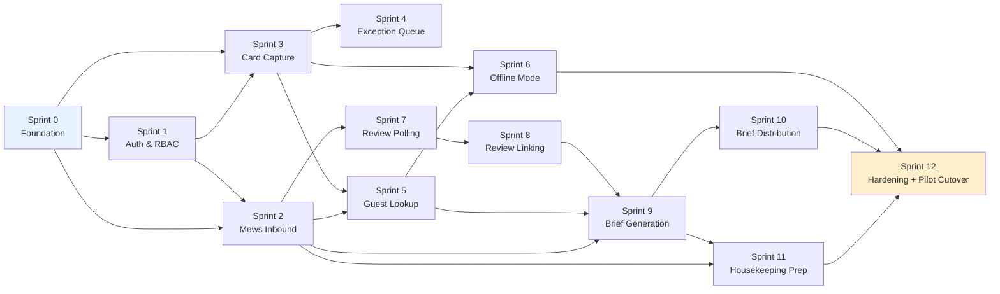

# Roomard — Sprint Plan v1.0

**Detailed sequencing for Sprints 0–12 to MVP customer-pilot cutover. The document an engineering lead runs weekly stand-ups against.**

| Field | Value |
|---|---|
| Document | Roomard Sprint Plan v1.0 |
| Date | 18 May 2026 |
| Companion to | All prior documents (BRD v2, UC Catalogue, Flows, Story Backlog, Architecture, Data Model, API Spec, Traceability, Test Strategy) |
| Scope | Sprints 0–12 (MVP path); V2 outline (Sprints 13–24) |
| Sprint cadence | 1-week sprints, Monday → Friday delivery, Friday demo |
| Team assumption | 4–5 engineers (2 backend, 1 frontend, 1 mobile, 1 part-time AI/ML), 1 PM, 1 QA, fractional design |
| Velocity assumption | ~14 points/sprint after Sprint 2 calibration |

---

## 0. Document map

| Section | Purpose |
|---|---|
| 1 | Sprint cadence and ceremonies |
| 2 | Definition of Ready, Definition of Done |
| 3 | Sprint dependencies map |
| 4 | Pre-Sprint-0 work (the work that has to happen before Sprint 0) |
| 5 | Sprints 0–12 — detailed plans |
| 6 | Sprint 11 hardening + pilot cutover |
| 7 | Risk register per sprint |
| 8 | V2 sprint outline (Sprints 13–24) |
| 9 | Critical path |
| 10 | What happens when sprints slip |

---

## 1. Sprint cadence and ceremonies

### 1.1 Weekly cadence

| Day | Ceremony | Duration | Output |
|---|---|---|---|
| Monday 09:00 | Sprint planning | 60 min | Sprint goal locked, stories assigned, capacity confirmed |
| Mon–Fri 09:30 | Daily stand-up | 15 min | Blockers surfaced, no status theatre |
| Wednesday 14:00 | Mid-sprint check | 30 min | Burndown reality-check; descope if needed |
| Friday 14:00 | Sprint demo | 45 min | Show working software; no slides, just product |
| Friday 15:00 | Sprint retro | 30 min | What worked, what didn't, one improvement for next sprint |

### 1.2 What does not happen weekly

- Backlog grooming is a continuous activity by the PM, not a weekly meeting
- "Refinement sessions" — replaced by async story write-up reviewed in sprint planning
- Story estimation by the whole team — engineers estimate stories they own, PM facilitates if needed
- Sprint planning over 60 minutes — if planning runs long, stories aren't ready (see §2.1)

### 1.3 Cross-sprint ceremonies

| Ceremony | Cadence | Purpose |
|---|---|---|
| Architecture review | Every 2 sprints | ADR proposals discussed; tech debt reviewed |
| Traceability matrix review | Weekly in sprint planning + monthly deep review | Per Traceability Matrix §3.3 |
| Quarterly audit pack mock | End of each quarter | Run an auditor's questions through the matrix and product |
| Customer Success sync | Weekly post-MVP | Pilot customer feedback integrated to backlog |

---

## 2. Definition of Ready, Definition of Done

### 2.1 Definition of Ready (DoR) — story enters a sprint

A story enters a sprint only if:

- [ ] Title and description follow INVEST format
- [ ] Linked to a parent use case in the Traceability Matrix
- [ ] Acceptance criteria are explicit and testable
- [ ] Story points estimated by the implementing engineer
- [ ] Dependencies identified; blockers resolved before the sprint
- [ ] Design artefacts referenced if UI work involved
- [ ] Test approach noted (which TC IDs from Test Strategy §11 it covers)

Stories failing DoR are sent back to the backlog. No "we'll figure it out in the sprint" — that's the bug DoR exists to prevent.

### 2.2 Definition of Done (DoD) — story leaves a sprint

A story is "done" only if all of these are true:

- [ ] Code merged to `main` and deployed to staging
- [ ] All acceptance criteria pass automated tests (per Test Strategy §11)
- [ ] Cross-cutting tests pass: tenancy, RBAC, audit (Test Strategy §12)
- [ ] If the story touches an AI prompt, relevant benchmark passes
- [ ] Documentation updated (any of: BRD, UC Catalogue, Architecture, Data Model, API Spec, Traceability Matrix — whatever the story affected)
- [ ] Traceability Matrix updated per its protocol (Traceability Matrix §3)
- [ ] Code reviewed by at least one peer
- [ ] QA Lead has signed off (for stories with user-visible changes)

### 2.3 What "done" doesn't mean

- It does **not** mean shipped to production. Production deploy is a separate weekly cadence after the sprint.
- It does **not** mean validated by customer. That's a post-launch loop.
- It does **not** mean perfect. Done is "AC satisfied"; polish iterations are separate stories.

---

## 3. Sprint dependencies map



Critical observations:

- **Sprint 2 (Mews Inbound)** unblocks Sprints 5, 7, 9, 11 — the most downstream-impacting sprint
- **Sprint 3 (Card Capture)** unblocks Sprints 4 and 5
- **Sprint 9 (Brief Generation)** requires Sprints 2, 5, and 8 — the latest-converging dependency
- **Sprint 12** is the cutover — everything before must be stable

---

## 4. Pre-Sprint-0 work (must complete before Sprint 0 starts)

This work does not happen in a sprint. It happens before. If skipped, Sprint 0 blocks immediately.

| Item | Owner | Why blocking |
|---|---|---|
| Resolve AQ-01: Baidu RDS for PostgreSQL EU region availability | Senthil + Baidu support | Determines whether EU-Postgres is Baidu or AWS Frankfurt — affects Sprint 0 migration scripts |
| Resolve AQ-02: Baidu BOS EU edge availability | Senthil + Baidu support | Same — affects object store provisioning |
| Resolve AQ-06: MeDo code-export licensing for production | Legal | Determines whether MeDo is in critical path or not |
| Resolve AQ-07: Qianfan rate limits for Year-1 capacity | Engineering | If limits won't support, need Enterprise tier negotiation |
| Resolve Q-01: Flagship pilot PMS (Mews vs alternatives) | Senthil | Confirms Sprint 2 build target |
| Resolve Q-07: Voice memo language scope for MVP (recommend: UK English only for MVP, defer multilingual to V2) | Senthil | Confirms architecture surface |
| UK corpus acquisition begins (Test Strategy §6) | Senthil + Customer Success | Labelled data must exist by Sprint 3 |
| Team assembled, dev tooling chosen, repo structure agreed | Engineering Lead | Sprint 0 cannot run without |
| Cloud accounts provisioned (Baidu AI Cloud + Qianfan + AWS Frankfurt if needed) | Engineering Lead | Sprint 0 needs deployable infrastructure |
| Tenant `pestana-pilot` provisioned (or whatever the flagship customer is) on staging — synthetic for now | Engineering Lead | Sprint 2 onwards needs a test tenant |
| Initial design tokens and Figma library available | Design | Sprint 3 onwards benefits |

**Honest:** this is 2–4 weeks of work depending on Baidu region availability resolution. Don't compress.

---

## 5. Sprints 0–12 — detailed plans

Each sprint has: goal, key stories (with points), dependencies in/out, risks, demo target, definition-of-success.

### Sprint 0 — Foundation (Week 1)

**Goal:** Working dev/staging environment, CI/CD, multi-tenant scaffold, base auth — no user-facing functionality.

| Story | Points | Owner |
|---|---|---|
| US-FND-1: Local dev environment via `make up` | 3 | Backend |
| US-FND-2: CI/CD pipeline to staging | 5 | Backend |
| US-FND-3: Tenant-isolated staging with seed data | 3 | Backend |
| US-FND-4: Row-level multi-tenant isolation | 5 | Backend |
| **Total** | **16** | |

**Sprint goal demo:** Engineer joins repo Friday afternoon, runs `make up`, has working environment in < 1 hour. Push a hello-world to `main` → deployed to staging within 10 min.

**Risks:**
- Cloud account provisioning delays (mitigated: started in pre-Sprint-0)
- Tooling decisions take longer than expected (mitigated: timebox decisions to Monday)

**Dependencies out:** All subsequent sprints depend on Sprint 0 completing.

**Success criteria:**
- [ ] Local dev environment works for every team member
- [ ] CI/CD deploys to staging on merge
- [ ] At least one tenant in staging with seed data visible
- [ ] RLS policies tested with synthetic cross-tenant attempt → blocked

### Sprint 1 — Authentication & RBAC (Week 2)

**Goal:** Users authenticate via SSO, RBAC enforces permissions, every API request authorised.

| Story | Points | Owner |
|---|---|---|
| US-28-1: Admin sees and manages roles | 3 | Backend |
| US-28-2: System enforces RBAC ≤ 50ms per request | 5 | Backend |
| US-28-3: System logs permission denials | 3 | Backend |
| US-29-1: IT Admin configures SAML SSO ≤ 30 min | 5 | Backend |
| **Total** | **16** | |

**Sprint goal demo:** Configure SSO with Microsoft Entra ID test tenant; user logs in via SSO; navigates to an unpermitted endpoint → 403 + audit log entry.

**Risks:**
- SAML implementation gotchas (test IdPs are flaky); mitigation: use saml.to or test-saml.com sandbox for staging
- Permission overhead exceeds 50ms; mitigation: cache resolved permissions per request

**Dependencies in:** Sprint 0 complete.
**Dependencies out:** Sprint 2 needs auth for status endpoint; all subsequent sprints need RBAC.

**Success criteria:**
- [ ] SSO login flow works end-to-end with Entra ID, Okta, Google
- [ ] Permission check overhead p99 < 50ms
- [ ] Permission denials produce audit log entries with full context

### Sprint 2 — Mews Inbound Sync + SSO User Login (Week 3)

**Goal:** Mews data flows into Roomard reliably. Staff users can log in via SSO and reach the home screen.

| Story | Points | Owner |
|---|---|---|
| US-24a-1: Receive Mews webhooks and persist | 5 | Backend |
| US-24a-2: Hourly reconciliation | 3 | Backend |
| US-24a-3: Admin sees sync health on status page | 3 | Backend |
| US-29-2: Staff user logs in via SSO | 3 | Backend + Frontend |
| **Total** | **14** | |

**Sprint goal demo:** Mews staging environment posts a webhook → Roomard receives, fetches full record, stores → status page shows event 30s after Mews. Admin logs in via SSO, sees status page.

**Risks:**
- Mews sandbox/staging API access delays; mitigation: kick off Mews developer registration in pre-Sprint-0
- Webhook signature verification edge cases; mitigation: dedicated integration tests with Mews's published examples

**Dependencies in:** Sprints 0, 1 complete.
**Dependencies out:** Sprints 5, 7, 9, 11 need PMS data.

**Success criteria:**
- [ ] Mews booking event appears in Roomard staging within 30s p99
- [ ] Hourly reconciliation correctly detects synthetic missed events
- [ ] Admin status page shows accurate health

**Velocity calibration check:** After Sprint 2, re-baseline velocity assumption (target was 14 points/sprint; if actual is 11, slide MVP from 12 to 15 weeks. **Don't compress.**)

### Sprint 3 — Card Capture Pipeline (Week 4)

**Goal:** A front-desk agent can photograph a card on mobile and see structured fields returned within 5 seconds.

| Story | Points | Owner |
|---|---|---|
| US-01-1: Capture card via mobile PWA camera | 3 | Mobile |
| US-01-2: OCR results within 5 seconds | 5 | Backend + AI/ML |
| US-01-3: Per-field confidence display | 2 | Mobile + Backend |
| US-PLAT-1: MeDo-orchestrated OCR→LLM pipeline | 3 | Backend + AI/ML |
| **Total** | **13** | |

**Sprint goal demo:** Engineer photographs a real (synthetic) check-in card on mobile PWA; structured fields appear in 5s with confidence scores.

**Risks:**
- **PWA camera quality variability** — this is the biggest unknown of the whole MVP. Mitigation: test on 3+ devices in week 1 of sprint; if quality fails, kick the React Native decision (per Architecture §7.2)
- **UK English OCR benchmark not ready** — if UK corpus acquisition slipped, Sprint 3 ships against an untested model; this is unacceptable. Mitigation: corpus must be at minimum 50 cards before Sprint 3 starts
- ERNIE entity extraction quality on cursive UK handwriting; mitigation: prompt engineering iterations are part of the sprint

**Dependencies in:** Sprints 0, 1; UK corpus available.
**Dependencies out:** Sprints 4, 5, 6 depend on capture flow.

**Decision gate:** End of Sprint 3 — PWA vs React Native call per Architecture ADR-004. Document the decision.

**Success criteria:**
- [ ] Card capture-to-result completes in p99 ≤ 8s on 4G simulation
- [ ] OCR confidence ≥ 0.80 on early UK benchmark (50 cards minimum)
- [ ] Per-field confidence visible to the user

### Sprint 4 — Exception Queue (Week 5)

**Goal:** Low-confidence card extractions land in a queue and are human-reviewable on web before they hit guest profiles.

| Story | Points | Owner |
|---|---|---|
| US-23-1: Concierge sees exception queue ordered by age | 3 | Frontend + Backend |
| US-23-2: Concierge approves/edits/rejects | 3 | Frontend + Backend |
| US-23-3: Resolved items flow to guest profile | 3 | Backend |
| US-01-5: Low-confidence routes to exception queue | 2 | Backend |
| US-23-4: Resolutions logged as training signal | 2 | Backend |
| **Total** | **13** | |

**Sprint goal demo:** Capture a deliberately blurry card → routes to exception queue → Concierge approves with edit → guest profile updated; full audit trail visible.

**Risks:**
- Exception queue UX needs design iteration; mitigation: design starts parallel to Sprint 3
- "Training signal logging" scope creep; mitigation: log only, no model retraining in MVP

**Dependencies in:** Sprint 3 complete (capture pipeline produces exception items).
**Dependencies out:** None blocking; UC-23 patterns reused by UC-03b, UC-05b later.

**Success criteria:**
- [ ] Queue load ≤ 2s for 200 items
- [ ] Median resolution ≤ 30s
- [ ] Audit trail complete on every resolution

### Sprint 5 — Mid-Conversation Guest Lookup (Week 6)

**Goal:** A front-desk agent in conversation can look up a guest on mobile and see priority info in 1.5 seconds.

| Story | Points | Owner |
|---|---|---|
| US-08-1: Agent searches and sees ranked candidates | 3 | Mobile + Backend |
| US-08-2: Priority preferences in 3 bullets | 3 | Backend + AI/ML |
| US-08-3: "Say this" suggestion | 5 | Backend + AI/ML |
| US-08-4: Drill into full profile + evidence | 3 | Mobile + Frontend |
| **Total** | **14** | |

**Sprint goal demo:** Engineer searches "patel" on mobile while staging has 100 synthetic guests; results in < 1.5s; tap a guest, see 3 priority preferences + "say this"; drill to evidence.

**Risks:**
- **"Say this" suggestion quality** — this is the magic moment of the product; mitigation: dedicate AI/ML time to prompt engineering and a manual review benchmark this sprint
- Search latency under load; mitigation: search index decision (built-in tsvector vs Elastic) made in Sprint 0 per AQ DM-03

**Dependencies in:** Sprints 0, 1, 2, 3.
**Dependencies out:** Sprints 6 (offline mode), 9 (brief uses similar synthesis logic).

**Success criteria:**
- [ ] Lookup p99 < 1.5s on 4G
- [ ] Top-3 contains target guest ≥ 95% on initial benchmark
- [ ] "Say this" passes Product manual review on ≥ 80% of 50 samples

### Sprint 6 — Offline Mode for Mobile (Week 7)

**Goal:** Mobile PWA works at the desk during wifi flakiness — capture and lookup both function offline.

| Story | Points | Owner |
|---|---|---|
| US-01-4: Offline capture | 3 | Mobile |
| US-08-5: Offline guest lookup for today's arrivals | 3 | Mobile + Backend |
| US-PLAT-2: Mobile PWA local cache | 5 | Mobile + Backend |
| US-PLAT-3: Offline queue sync with conflict detection | 3 | Mobile + Backend |
| **Total** | **14** | |

**Sprint goal demo:** Engineer puts phone in airplane mode, captures a card, looks up a guest from today's arrivals → both work. Reconnects → queued capture syncs successfully.

**Risks:**
- IndexedDB quirks across browsers; mitigation: target iOS Safari and Chrome explicitly, test others as best-effort
- Conflict resolution on sync edge cases (offline edit + online edit of same record); mitigation: server-wins for MVP; surface conflict to user; defer auto-merge to V2

**Dependencies in:** Sprints 3, 5.
**Dependencies out:** None blocking.

**Success criteria:**
- [ ] Card capture works offline; queue holds up to 50 items
- [ ] Lookup works offline for today's arrivals + last 7 days cached profiles
- [ ] On reconnect, offline queue clears within 1 minute

### Sprint 7 — Review Polling & Ingestion (Week 8)

**Goal:** External reviews from TripAdvisor, Booking.com, and Google start flowing in with sentiment and topic extraction.

| Story | Points | Owner |
|---|---|---|
| US-25-1: Poll TripAdvisor every 2h | 3 | Backend |
| US-25-2: Poll Booking.com every 2h | 3 | Backend |
| US-25-3: Poll Google Business every 2h | 3 | Backend |
| US-05a-1: Admin connects review feeds | 5 | Backend + Frontend |
| US-05a-2: Sentiment + topic extraction | 3 | Backend + AI/ML |
| **Total** | **17** | **Heavy sprint — see risk** |

**Sprint goal demo:** Admin connects TripAdvisor sandbox to a staging tenant; new reviews appear in Roomard within 2.5 hours with sentiment and topics extracted.

**Risks:**
- **Sprint runs heavy (17 points vs 14 target).** Mitigation: if velocity wobbles in Sprint 6, drop US-05a-2 (sentiment extraction) to Sprint 8 — the polling still works, just no sentiment yet
- **TripAdvisor Partner API access timeline** — partner agreements can take 4–8 weeks. Mitigation: kicked off in pre-Sprint-0; if blocked, use Booking.com or Google for the demo

**Dependencies in:** Sprints 0, 1, 2.
**Dependencies out:** Sprint 8 needs review data flowing.

**Success criteria:**
- [ ] At least 2 of 3 platforms successfully connected and polling
- [ ] Sentiment accuracy ≥ 0.80 on UK benchmark
- [ ] Admin status page shows poll health

### Sprint 8 — Review-to-Guest Linking (Week 9)

**Goal:** Reviews automatically link to the guests they're about, with a manual review path for ambiguous cases.

| Story | Points | Owner |
|---|---|---|
| US-05a-3: Manager sees reviews on web console | 3 | Frontend + Backend |
| US-05b-1: System auto-links reviews to guests via ERNIE X1 | 5 | Backend + AI/ML |
| US-05b-2: Manager can manually link | 3 | Frontend + Backend |
| US-05b-3: Linked reviews on guest profile | 3 | Frontend + Backend |
| **Total** | **14** | |

**Sprint goal demo:** A new review arrives at staging → auto-links to a guest with 0.94 confidence → appears on the guest profile. Ambiguous review → routes to manager queue → manager links manually.

**Risks:**
- Identity matching false positives (review linked to wrong guest); mitigation: high auto-link threshold (>0.90); medium-confidence goes to human review

**Dependencies in:** Sprint 7.
**Dependencies out:** Sprint 9 (brief uses review data).

**Success criteria:**
- [ ] Auto-link precision ≥ 0.90 on 200-review benchmark
- [ ] Manual link UX takes ≤ 30 seconds median
- [ ] Linked reviews chronologically visible on guest profile

### Sprint 9 — Arrival Brief Generation (Week 10)

**Goal:** Daily arrival briefs generate at 06:00 local with prioritisation, 1-paragraph narrative per arrival, source attribution.

| Story | Points | Owner |
|---|---|---|
| US-07a-1: Fetch arrivals from PMS at 06:00 | 3 | Backend |
| US-07a-2: Prioritise arrivals via ERNIE X1 | 5 | Backend + AI/ML |
| US-07a-3: Generate 1-paragraph brief per arrival | 5 | Backend + AI/ML |
| US-07a-4: Regenerate if arrivals change pre-11:00 | 3 | Backend |
| **Total** | **16** | |

**Sprint goal demo:** At Friday 06:00 staging clock, brief generates for a 30-arrival synthetic property → 8 prioritised + 22 standard, each with narrative and source attribution; PM changes synthetic arrivals at 10:30 → brief regenerates.

**Risks:**
- **The single most important quality moment of the MVP.** Prioritisation and narrative quality define whether the product feels magical or robotic. Mitigation: dedicate AI/ML time to prompt engineering across multiple iterations this sprint; weekly Product review of brief samples
- Brief generation latency at scale (50 properties × 30 arrivals = 1,500 inference calls in a 30-min window); mitigation: parallelism, ERNIE X1 used sparingly (prioritisation only, not narrative)

**Dependencies in:** Sprints 0, 2 (PMS data), 5 (lookup synthesis logic), 8 (review data flowing).
**Dependencies out:** Sprint 10 (distribution).

**Success criteria:**
- [ ] Brief generated for every property by 06:30 local
- [ ] Priority section capped at 8 arrivals
- [ ] Every brief item has at least one source attribution
- [ ] Product review of 30 sample briefs rates ≥ 4.0/5.0 on usefulness rubric

### Sprint 10 — Brief Distribution (Web + Mobile) (Week 11)

**Goal:** The brief reaches the Front Desk Manager and Concierge on the right surface at the right time with one-tap drilldown.

| Story | Points | Owner |
|---|---|---|
| US-07b-1: FDM receives brief on mobile push by 06:30 | 3 | Mobile + Backend |
| US-07b-2: FDM sees full brief on web with drilldown | 5 | Frontend + Backend |
| US-07b-3: Concierge receives role-filtered brief | 3 | Backend + Frontend + Mobile |
| US-07b-4: Manager marks items as briefed | 2 | Frontend + Mobile + Backend |
| **Total** | **13** | |

**Sprint goal demo:** Friday 06:30, push notification arrives on engineer's phone with brief; engineer opens on mobile (summary view), then on web (full view with drilldown); marks 3 items as briefed → status syncs across both surfaces.

**Risks:**
- **iOS PWA push reliability** — known limitation. Mitigation: email fallback at 06:45 is in the spec; SMS for Enterprise tier is V2

**Dependencies in:** Sprint 9.
**Dependencies out:** Sprint 12 cutover.

**Success criteria:**
- [ ] Push delivery ≥ 95% within 5 minutes on Android; ≥ 90% on iOS
- [ ] Mobile and web views show consistent state
- [ ] "Briefed to team" tracking works across surfaces

### Sprint 11 — Housekeeping Prep Cards (Week 12)

**Goal:** Housekeeping joins the product. Multi-surface, multi-role story proven.

| Story | Points | Owner |
|---|---|---|
| US-09-1: Generate prep cards at 18:00 D-1 | 3 | Backend + AI/ML |
| US-09-2: Supervisor sees all cards on mobile | 3 | Mobile + Backend |
| US-09-3: Housekeeper sees assigned rooms with cards | 3 | Mobile + Backend |
| US-09-4: Housekeeper marks complete in ≤ 3 taps | 2 | Mobile + Backend |
| **Total** | **11** | **Light sprint — buffer** |

**Sprint goal demo:** 18:00 staging clock → 12 prep cards generated for tomorrow's synthetic arrivals; Supervisor opens mobile, assigns rooms; Housekeeper sees their 4 rooms, taps "Prep complete" with photo on one.

**Risks:**
- Light sprint deliberately — buffer for any prior-sprint slip; mitigation: if velocity is on-track, use buffer for performance optimisation, bug fixes, polish

**Dependencies in:** Sprints 0, 2, 9.
**Dependencies out:** Sprint 12 cutover.

**Success criteria:**
- [ ] Cards generated by 18:30 D-1
- [ ] Mobile "Mark complete" in ≤ 3 taps
- [ ] Supervisor sees real-time completion status

---

## 6. Sprint 12 — Hardening + Pilot Cutover (Week 13)

**Not a feature sprint.** This is the bridge from "MVP code complete" to "first paying customer."

### 6.1 Sprint 12 goals

| Workstream | Outcome |
|---|---|
| **Performance tuning** | All SLOs from Solution Architecture §11.2 met on staging at Year-1 capacity × 1.5 |
| **UK benchmark final run** | All 4 AI benchmarks pass thresholds on full UK corpus (200 cards, 500 reviews, 100 emails, gazetteer) |
| **Security review** | Third-party penetration test completed; all high/critical findings resolved |
| **Compliance gate** | GDPR posture documented; DPA template ready; UK ICO registration complete |
| **Customer onboarding pack** | Mews integration cert; tenant provisioning runbook; pilot DPA; customer success playbook v1 |
| **First customer pilot kickoff** | Tenant provisioned; Mews connected; staff users invited; pilot starts |

### 6.2 Sprint 12 workstream breakdown

| Day | Activity | Owner |
|---|---|---|
| Mon | Performance test at 1.5× Year-1 load on staging; identify bottlenecks | Engineering |
| Tue | Performance tuning; final UK benchmark run on full corpus | Engineering + AI/ML |
| Wed | Third-party pen test results review; remediation | Engineering + Security |
| Thu | Customer onboarding dry run on staging with fake tenant; compliance final check | All |
| Fri | **Cutover day.** Pilot tenant provisioned; Mews connected; SSO configured with customer IdP; first staff users invited | All hands |

### 6.3 Cutover gate — go/no-go decision

The cutover happens Friday afternoon only if ALL of these are green:

- [ ] All MVP acceptance criteria pass automated tests (per Test Strategy §11)
- [ ] All 4 AI benchmarks pass on UK corpus
- [ ] No high/critical security findings outstanding
- [ ] GDPR DPA executed with pilot customer
- [ ] Mews integration certified or in formal certification process
- [ ] Pilot customer staff trained (or training scheduled within 7 days)
- [ ] On-call rotation in place

If any of these are red, **delay the cutover.** A red cutover is a recoverable problem; a customer-facing failure week 1 is not.

### 6.4 Post-cutover Sprint 13 plan (preview)

Sprint 13 is dedicated to **customer-driven backlog** for the first 7 days post-launch. No new feature work. Whatever the pilot customer asks for becomes top of the backlog. This is the "earn the second customer" sprint.

---

## 7. Risk register per sprint — consolidated

| Sprint | Top risk | Mitigation if it fires |
|---|---|---|
| 0 | Cloud provisioning delays | Pre-Sprint-0 work; weeks 1–2 buffer |
| 1 | SAML / OIDC test IdP flakes | Use saml.to or test-saml.com sandbox |
| 2 | Mews sandbox access slow | Mews dev registration in pre-Sprint-0 |
| 3 | **PWA camera quality fails benchmark** | Trigger React Native decision (ADR-004); slip Sprint 6+ by 1–2 sprints |
| 4 | Exception queue UX needs redesign | Design starts Sprint 3 parallel |
| 5 | "Say this" suggestion quality poor | Extra AI/ML week; manual review benchmark from Sprint 5 |
| 6 | Browser-specific PWA quirks | Target Safari + Chrome; others best-effort |
| 7 | **TripAdvisor Partner API access delayed** | Demo with Booking.com or Google; partner API in Sprint 14 |
| 8 | Identity match false positives | High auto-link threshold; manual review path |
| 9 | **Brief quality feels robotic, not magical** | Iterate prompts across whole sprint; Product reviews 30 samples weekly |
| 10 | iOS PWA push reliability | Email fallback; SMS for Enterprise V2 |
| 11 | (light sprint, low risk) | Buffer for prior slips |
| 12 | **Cutover gate red — delay required** | Slip cutover; do not ship red |

---

## 8. V2 sprint outline (Sprints 13–24)

Post-pilot. Specific stories from User Story Backlog §B.

| Sprint | Theme | Primary UCs |
|---|---|---|
| 13 | Pilot customer-driven backlog | (customer signal) |
| 14 | Audit log + DPO foundations | UC-21 |
| 15 | Right-to-be-forgotten + SAR | UC-18, UC-19 |
| 16 | Guest privacy panel + audit pack export | UC-18b, UC-20 |
| 17 | Paper service tickets | UC-02 |
| 18 | Email ingestion + extraction | UC-03a, UC-03b |
| 19 | Voice memo preference capture | UC-04 |
| 20 | Cross-property identity resolution | UC-06a, UC-06b |
| 21 | Cross-property journey view | UC-15 |
| 22 | OTA recapture tracking (the buyer's report) | UC-17 |
| 23 | Complaint trajectory + narrative summary + D-3 prep | UC-11, UC-12, UC-13 |
| 24 | F&B prep + preference correction + outbound PMS sync | UC-10, UC-14, UC-24b |

After Sprint 24 (~6 months post-MVP), product is at ~70% of full catalogue. Second flagship customer should be live by Sprint 18; third by Sprint 24.

---

## 9. Critical path

The critical path from Sprint 0 to MVP launch:

```
Sprint 0 → Sprint 1 → Sprint 2 → Sprint 3 (camera & OCR gate) →
Sprint 5 (lookup quality gate) → Sprint 9 (brief quality gate) →
Sprint 10 → Sprint 12 (cutover gate)
```

Sprints 4, 6, 7, 8, 11 are important but not on the strict critical path — they can slip 1 sprint each without delaying MVP launch. Sprints 3, 5, 9, 12 cannot slip without delaying launch.

**Three quality gates that cannot be compromised:**
1. **End of Sprint 3** — PWA camera + UK OCR benchmark pass
2. **End of Sprint 5** — "Say this" suggestion appropriateness ≥ 80%
3. **End of Sprint 9** — Brief usefulness Product review ≥ 4.0/5.0

A red gate means slip; a yellow gate means review, decide, document.

---

## 10. What happens when sprints slip

### 10.1 Single-sprint slip (most common)

- One sprint behind: no escalation; absorb into the next sprint or the Sprint 11 buffer
- Two sprints behind: Engineering Lead + PM review; decide between scope cut and date slip
- Three+ sprints behind: full team review; commit to a new date

### 10.2 Critical path slip

If Sprint 3, 5, 9, or 12 slips: **date slips, scope does not.** This is the principle. Shipping a yellow brief or red OCR damages the product reputation permanently with the pilot customer.

### 10.3 Velocity reality check

After Sprint 2, run the velocity calibration. If actual is 11 points/sprint (vs target 14):
- MVP launch date shifts from Week 13 to Week 16
- Communicate to pilot customer; reset expectations
- Don't compress sprints to recover; that's how quality drops

### 10.4 The forbidden recovery moves

These look attractive but are forbidden:

- "Cut tests to ship faster" → tests are the spec; cutting them ships unknown behaviour
- "Skip the UK benchmark for now" → ships against an untested model; customer sees the failure first
- "Defer compliance to V2" → cannot sell to UK customers without it; commercial death
- "Skip the cutover gate" → red launch is recoverable as bug fix; red customer relationship is not

---

## 11. What this document does *not* cover

| Topic | Belongs in |
|---|---|
| Day-by-day daily stand-up notes | Engineering team's running document |
| Per-engineer task assignment | Issue tracker / project board |
| Customer-specific delivery commitments | Customer Success / sales contract |
| Real-time sprint progress | Burndown dashboard |
| Marketing launch plan | Out of scope here |
| Hiring plan | Out of scope here |

---

## 12. Document control

| Version | Date | Author | Changes |
|---|---|---|---|
| 1.0 | 18 May 2026 | Senthil with Claude | Initial sprint plan: 12 sprints to MVP, V2 outline through Sprint 24, critical path identified, cutover gate defined |

---

*End of Roomard Sprint Plan v1.0 — 18 May 2026.*

*End of Roomard document set v1.0 — 10 documents.*
