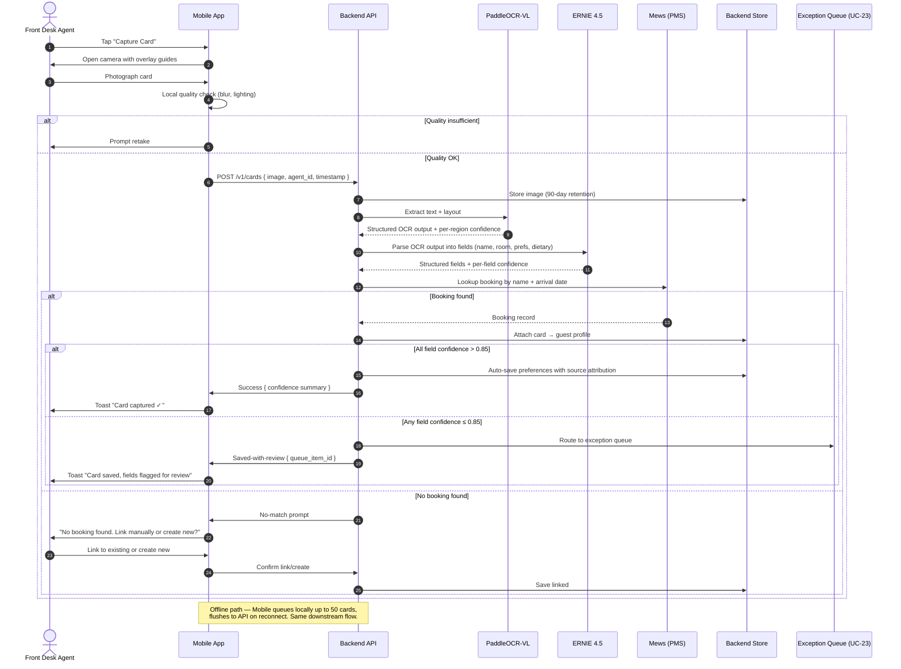
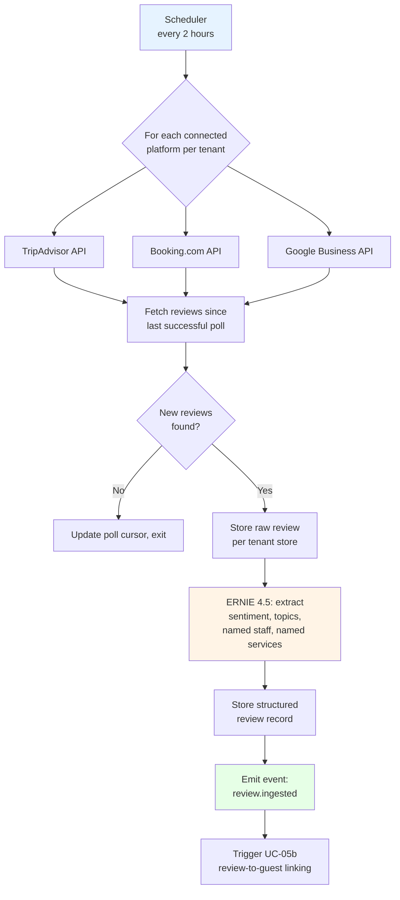
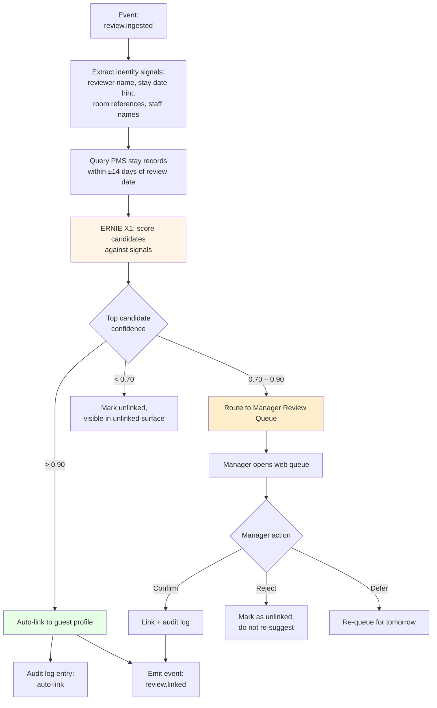
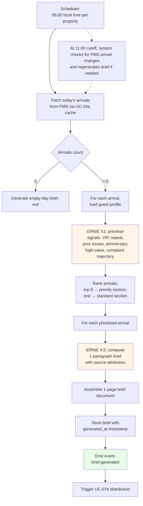
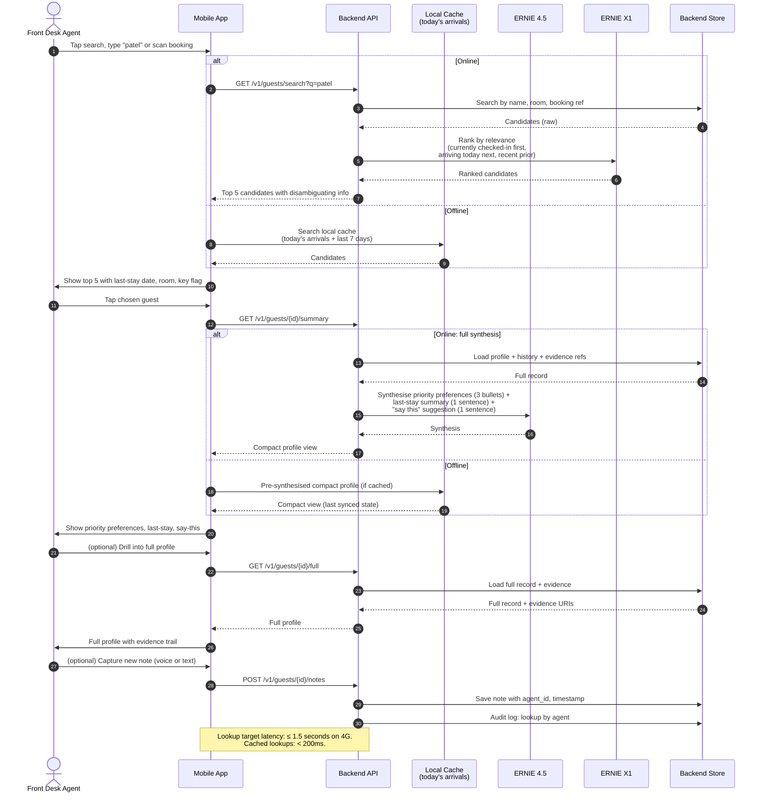
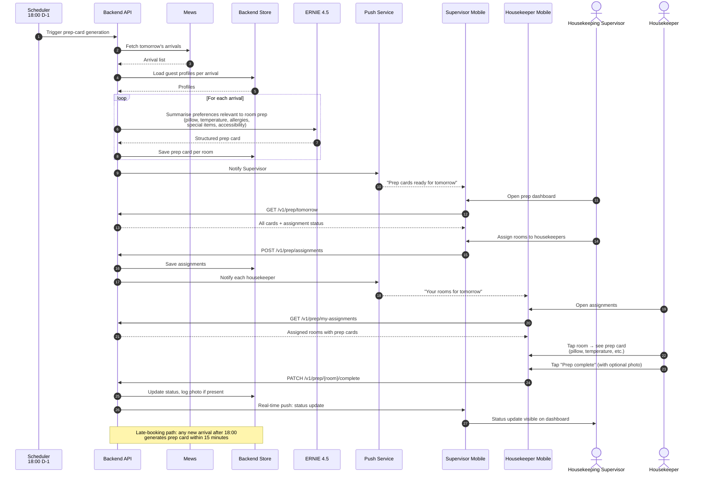
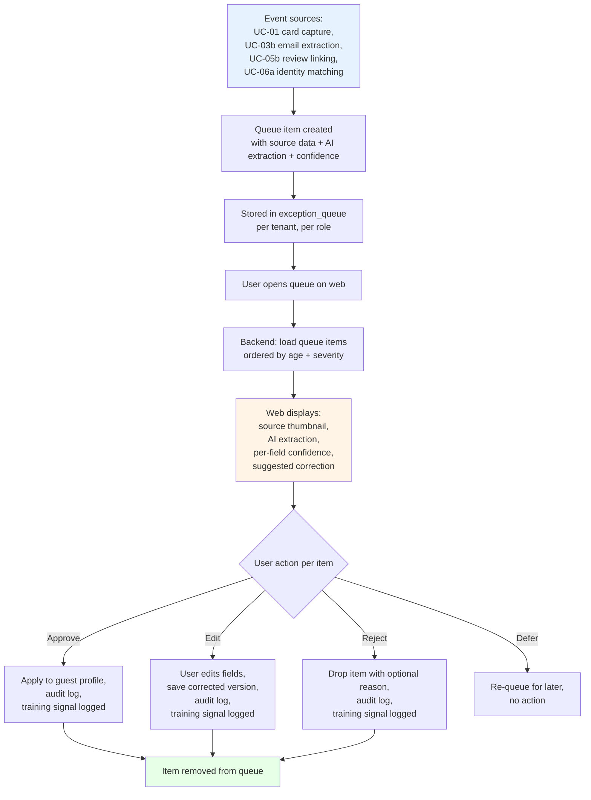
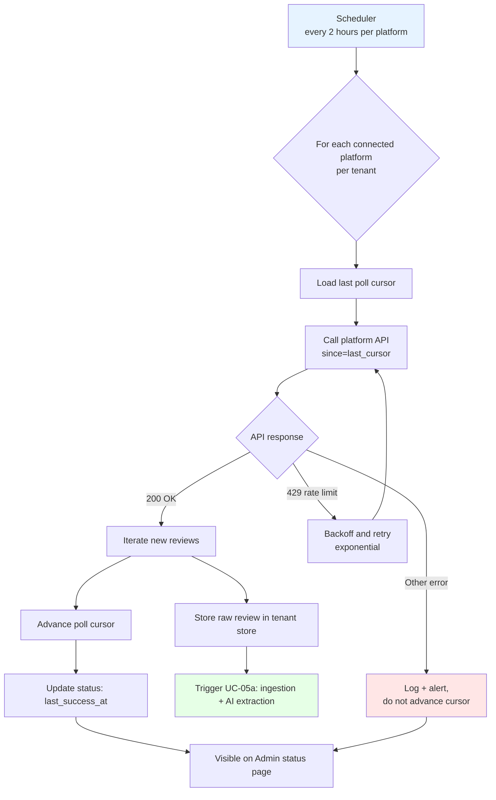
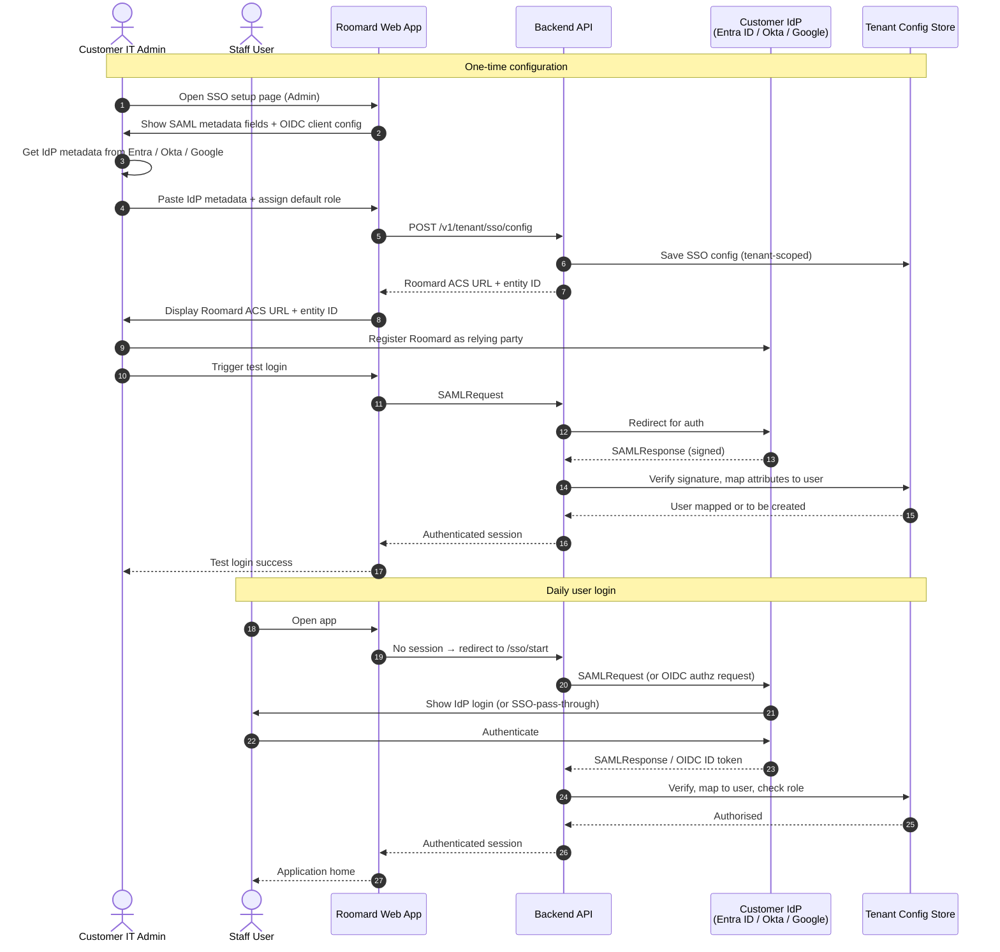

# Roomard — Use Case Flow Diagrams v1.0

**Visual swimlane flows for MVP use cases. Mermaid-based, renderable in any markdown viewer that supports Mermaid (GitHub, GitLab, Obsidian, VS Code, Notion, etc.).**

| Field | Value |
|---|---|
| Document | Roomard Use Case Flow Diagrams v1.0 |
| Date | 18 May 2026 |
| Companion to | Roomard BRD v2.0, Use Case Catalogue v1.0 |
| Scope | 8 MVP use cases (UC-01, UC-05a, UC-05b, UC-07a, UC-07b, UC-08, UC-09, UC-23, UC-24a, UC-25, UC-29) |
| Diagram format | Mermaid (sequence + flowchart hybrid) |
| Notation | Five-lane swimlane: User · Client (Web/Mobile) · Backend Services · AI Services · External System |

---

## 0. How to read these diagrams

Each flow uses one of two Mermaid forms:

- **Sequence diagram** — for interactive flows where time order matters and there's back-and-forth between user, system, and AI
- **Flowchart** — for background/scheduled flows where branching logic and decision points matter more than timing

Both forms use consistent lane assignments:

| Lane name | What it is |
|---|---|
| **User** | Human actor (Front Desk Agent, Concierge, GM, etc.) |
| **Client** | Mobile app or web app — the surface the user touches |
| **Backend** | Roomard application services (orchestration, storage, business logic) |
| **AI** | Qianfan MaaS endpoints (PaddleOCR-VL, ERNIE 4.5, ERNIE X1) |
| **External** | PMS (Mews), review platforms (TripAdvisor / Booking / Google), SSO IdP |

Exception flows are shown with `alt` blocks (sequence) or branching diamonds (flowchart). Web-vs-mobile divergence is shown in notes where it matters; mostly the flows are surface-agnostic and the client lane simply represents whichever surface the user is on.

---

## UC-01 — Capture Handwritten Check-In Card

**Surface:** Mobile primary, web fallback. Mobile flow shown; web is identical except for camera invocation (file upload instead of native camera).



---

## UC-05a — External Review Ingestion

**Surface:** Background scheduled. No user lane.



---

## UC-05b — Review-to-Guest Linking

**Surface:** Background event-driven; web surface for manual review queue.



---

## UC-07a — Daily Arrival Brief Generation

**Surface:** Background scheduled. Output consumed by UC-07b.



---

## UC-07b — Daily Arrival Brief Distribution

**Surface:** Web + Mobile, both first-class.

```mermaid
sequenceDiagram
    autonumber
    participant Sched as Scheduler<br/>(post UC-07a)
    participant API as Backend API
    participant Push as Push Service
    participant Email as Email Service
    participant WebApp as Web App
    participant MobileApp as Mobile App
    actor FDM as Front Desk Manager
    actor Conc as Concierge
    participant Store as Backend Store

    Sched->>API: brief.generated event
    API->>Push: Send push notification to FDM, Concierge devices
    API->>Email: Send brief summary email (fallback channel)
    API->>WebApp: Brief available at /briefs/today

    par Mobile path
        Push-->>MobileApp: Notification "Today's brief ready"
        FDM->>MobileApp: Tap notification
        MobileApp->>API: GET /v1/briefs/today
        API->>Store: Fetch brief
        Store-->>API: Brief data
        API-->>MobileApp: Brief JSON (mobile-shaped)
        MobileApp->>FDM: Show priority section first,<br/>tap to expand each item
        FDM->>MobileApp: Tap "Mark Briefed to team"
        MobileApp->>API: PATCH /v1/briefs/today/item/{id} { briefed: true }
        API->>Store: Update status
    and Web path
        FDM->>WebApp: Open https://app.roomard.com/briefs/today
        WebApp->>API: GET /v1/briefs/today?detail=full
        API->>Store: Fetch brief
        Store-->>API: Brief data
        API-->>WebApp: Brief JSON (full detail)
        WebApp->>FDM: Show full brief with drill-down
        FDM->>WebApp: Tap "View evidence" on item
        WebApp->>API: GET /v1/guests/{id}/evidence
        API-->>WebApp: Source records (card photo, review, email snippets)
    end

    Conc->>MobileApp: Open brief (filtered to concierge responsibilities)
    MobileApp->>API: GET /v1/briefs/today?role=concierge
    API-->>MobileApp: Brief filtered to concierge items

    Note over MobileApp,WebApp: Both surfaces share the same brief data.<br/>Mobile is summary-first; web is detail-first.<br/>"Briefed to team" status syncs across surfaces.
```

---

## UC-08 — Mid-Conversation Guest Lookup

**Surface:** Mobile primary, web fallback.



---

## UC-09 — Generate Housekeeping Room Prep Card

**Surface:** Mobile (housekeeping side) + Web (supervisor side).



---

## UC-23 — Confidence-and-Exception Review Queue

**Surface:** Web primary, mobile fallback.



---

## UC-24a — PMS Inbound Sync (Mews flagship)

**Surface:** Background, with admin status surface on web.

```mermaid
sequenceDiagram
    autonumber
    participant Mews as Mews PMS
    participant Webhook as Webhook Receiver
    participant API as Backend API
    participant Recon as Reconciliation Service<br/>(hourly)
    participant Store as Backend Store
    participant Health as Status Page<br/>(web)
    actor Admin as Tenant Admin

    Note over Mews,Webhook: Real-time event stream

    Mews->>Webhook: POST event { booking.created, booking.modified,<br/>check_in, check_out, no_show, cancellation }
    Webhook->>Webhook: Verify signature
    Webhook->>API: Validated event
    API->>Mews: GET full record by booking_id
    Mews-->>API: Full booking + guest record
    API->>Store: Upsert with PMS reference ID
    API->>API: Trigger downstream events<br/>(arrival.new → UC-07a; check_in → UC-01 path)

    Note over Mews,Recon: Reconciliation (catches missed events)

    Recon->>API: Hourly trigger
    API->>Mews: GET arrivals next 7 days
    Mews-->>API: Current snapshot
    API->>Store: Diff vs local cache
    alt Mismatch detected
        API->>Mews: GET full records for mismatched IDs
        Mews-->>API: Records
        API->>Store: Reconcile
        API->>Health: Log reconciliation event
    end

    Admin->>Health: Open sync status page
    Health-->>Admin: Show: last event time,<br/>event rate per hour,<br/>last reconciliation,<br/>queued / failed events
```

---

## UC-25 — TripAdvisor / Booking / Google Review Polling

**Surface:** Background scheduled.



---

## UC-29 — SSO Integration (SAML / OIDC)

**Surface:** Web only.



---

## Cross-cutting flow — Authentication & Permission Check (every request)

This isn't a UC on its own but underpins every UC above. Worth showing once.

```mermaid
flowchart LR
    A[Request from<br/>Web/Mobile] --> B{Session valid?}
    B -- No --> C[401 Unauthorized<br/>or redirect to SSO]
    B -- Yes --> D[Load user + roles + tenant]
    D --> E{Role permits<br/>this action on<br/>this resource?}
    E -- No --> F[403 Forbidden<br/>+ audit log denial]
    E -- Yes --> G{Tenant data<br/>boundary check}
    G -- Wrong tenant --> F
    G -- OK --> H[Proceed to handler]
    H --> I{Sensitive data<br/>(Class A PII)?}
    I -- Yes --> J[Audit log: read/write<br/>with full context]
    I -- No --> K[Continue]
    J --> K
    K --> L[Response]

    style F fill:#ffe6e6
    style J fill:#fff4e6
```

---

## Diagram coverage summary

| UC | Diagram type | Notes |
|---|---|---|
| UC-01 | Sequence | Mobile-primary, includes offline path |
| UC-05a | Flowchart | Background, scheduled |
| UC-05b | Flowchart | Event-driven, branching by confidence |
| UC-07a | Flowchart | Background, scheduled |
| UC-07b | Sequence | Dual surface (web + mobile parallel paths) |
| UC-08 | Sequence | Mobile-primary, online + offline paths |
| UC-09 | Sequence | Multi-actor (Supervisor + Housekeeper) |
| UC-23 | Flowchart | Web UI flow with decision branches |
| UC-24a | Sequence | Background, includes reconciliation |
| UC-25 | Flowchart | Background poll with error handling |
| UC-29 | Sequence | Two-phase: setup and daily login |

**Total MVP diagrams: 11** (8 MVP UCs, with UC-05, UC-07, and UC-24 split into a + b).

---

## What's not yet diagrammed

The 26 remaining (non-MVP) UCs do not yet have flow diagrams. These will be produced in a v2 of this document if/when those UCs enter active sprint planning. Producing all 37 diagrams up front is premature optimisation — UC flows often shift slightly as architectural decisions land.

---

## Document control

| Version | Date | Author | Changes |
|---|---|---|---|
| 1.0 | 18 May 2026 | Senthil with Claude | MVP coverage: 11 diagrams across 8 MVP use cases |

---

*End of Roomard Use Case Flow Diagrams v1.0 — 18 May 2026.*
